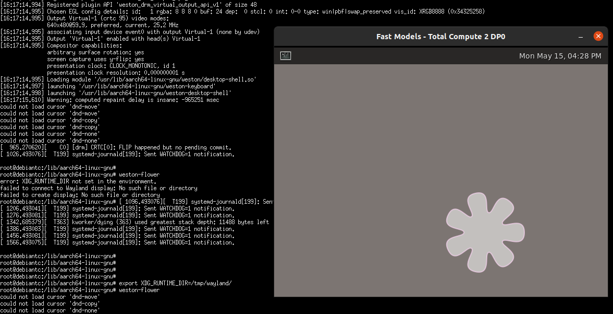
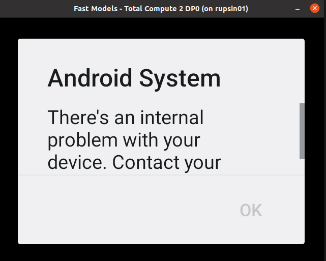

.. _docs/totalcompute/tc2/expected-test-results:

Expected test results
=====================

.. contents::

.. _docs/totalcompute/tc2/expected-test-results_optee:

OP-TEE unit tests
-----------------

::

	# xtest
	Run test suite with level=0

	TEE test application started over default TEE instance
	######################################################
	#
	# regression
	#
	######################################################

	* regression_1001 Core self tests
	 - 1001 -   skip test, pseudo TA not found
	  regression_1001 OK

	* regression_1002 PTA parameters
	 - 1002 -   skip test, pseudo TA not found
	  regression_1002 OK
	
	(...output truncated...)
	
	regression_8101 OK
	regression_8102 OK
	regression_8103 OK
	+-----------------------------------------------------
	26197 subtests of which 0 failed
	104 test cases of which 0 failed
	0 test cases were skipped
	TEE test application done!
	#

.. _docs/totalcompute/tc2/expected-test-results_ts:

Trusted Services and Client application unit tests
--------------------------------------------------

Expected command output for the Trusted Services:

::

	# ts-service-test -sg ItsServiceTests -sg PsaCryptoApiTests -sg CryptoServicePackedcTests -sg CryptoServiceProtobufTests -sg CryptoServiceLimitTests -v
	TEST(ItsServiceTests, storeNewItem) - 3903 ms
	TEST(CryptoServicePackedcTests, generateRandomNumbers) - 8063 ms
	TEST(CryptoServicePackedcTests, asymEncryptDecryptWithSalt) - 46995 ms
	TEST(CryptoServicePackedcTests, asymEncryptDecrypt) - 11187 ms
	TEST(CryptoServicePackedcTests, signAndVerifyEat) - 36934 ms
	TEST(CryptoServicePackedcTests, signAndVerifyMessage) - 37118 ms
	TEST(CryptoServicePackedcTests, signAndVerifyHash) - 37121 ms
	TEST(CryptoServicePackedcTests, exportAndImportKeyPair) - 5506 ms
	TEST(CryptoServicePackedcTests, exportPublicKey) - 7416 ms
	TEST(CryptoServicePackedcTests, purgeKey) - 4631 ms
	TEST(CryptoServicePackedcTests, copyKey) - 12366 ms
	TEST(CryptoServicePackedcTests, generatePersistentKeys) - 8316 ms
	TEST(CryptoServicePackedcTests, generateVolatileKeys) - 7886 ms
	TEST(CryptoServiceProtobufTests, generateRandomNumbers) - 5785 ms
	TEST(CryptoServiceProtobufTests, asymEncryptDecryptWithSalt) - 59963 ms
	TEST(CryptoServiceProtobufTests, asymEncryptDecrypt) - 15982 ms
	TEST(CryptoServiceProtobufTests, signAndVerifyMessage) - 37117 ms
	TEST(CryptoServiceProtobufTests, signAndVerifyHash) - 37177 ms
	TEST(CryptoServiceProtobufTests, exportAndImportKeyPair) - 5562 ms
	TEST(CryptoServiceProtobufTests, exportPublicKey) - 7467 ms
	TEST(CryptoServiceProtobufTests, generatePersistentKeys) - 8378 ms
	TEST(CryptoServiceProtobufTests, generateVolatileKeys) - 7896 ms
	TEST(CryptoServiceLimitTests, volatileRsaKeyPairLimit) - 814715 ms
	TEST(CryptoServiceLimitTests, volatileEccKeyPairLimit) - 197333 ms

	OK (43 tests, 24 ran, 206 checks, 0 ignored, 19 filtered out, 1425193 ms)

	#

Expected command output for the Client application:

::

	# ts-demo

	Demonstrates use of trusted services from an application
	---------------------------------------------------------
	A client requests a set of crypto operations performed by
	the Crypto service.  Key storage for persistent keys is
	provided by the Secure Storage service via the ITS client.

	Generating random bytes length: 1
		    Operation successful
		    Random bytes:
		            2B
	Generating random bytes length: 7
		    Operation successful
		    Random bytes:
		            68 CF 0C 5D 87 C7 11
	Generating random bytes length: 128
		    Operation successful
		    Random bytes:
		            BF C6 85 27 81 02 5F 83
		            60 97 E9 2C A6 30 8E F7
		            C6 81 44 CB 26 32 8D F5
		            62 BA 0F DE B8 2C 69 E2
		            DD C0 FF A0 04 E2 D0 C0
		            DC EA 11 CE DD 7E 33 87
		            62 07 89 02 00 68 FC 24
		            AD D2 E4 86 40 3F 6E 65
		            83 46 33 9A F8 84 14 3B
		            72 11 8D 63 59 6F 69 96
		            70 D2 83 8D 60 6D 9F A2
		            B3 54 F6 3E 5E B3 FE 07
		            C9 51 F1 6A F5 B0 0E AA
		            08 B3 AE F5 06 73 6C 8B
		            95 73 B2 FF 72 C6 CF 84
		            12 7A 7A 1F 07 F2 58 71
	Generating ECC signing key
		    Operation successful
	Signing message: "The quick brown fox" using key: 256
		    Operation successful
		    Signature bytes:
		            F9 F7 0E D0 4A B2 77 DF
		            67 40 F5 36 4D 92 38 A3
		            13 5B 04 A0 6C BD 84 40
		            03 E2 43 EE BF 6F C6 C4
		            5B 5D A4 21 D9 EB 17 86
		            B9 71 0D C9 84 0C FE 55
		            71 8E 5C F7 D4 7D EB 04
		            9B 5A 11 D7 46 96 BD A6
	Verify signature using original message: "The quick brown fox"
		    Operation successful
	Verify signature using modified message: "!he quick brown fox"
		    Successfully detected modified message
	Signing message: "jumps over the lazy dog" using key: 256
		    Operation successful
		    Signature bytes:
		            45 40 14 E3 39 0C 3B 8A
		            5F 05 C8 0C E0 B6 A6 D2
		            8B 5E E3 76 49 DD F1 9E
		            50 A0 77 6F 1B FA FF C8
		            38 66 6A 2D 40 B1 79 9C
		            43 BE 59 F4 48 45 A2 0E
		            D0 17 3F 1F D3 D7 C0 84
		            65 AC 9B 8A FB 6E B6 B6
	Verify signature using original message: "jumps over the lazy dog"
		    Operation successful
	Verify signature using modified message: "!umps over the lazy dog"
		    Successfully detected modified message
	Generating RSA encryption key
		    Operation successful
	Encrypting message: "Top secret" using RSA key: 257
		    Operation successful
		    Encrypted message:
		            42 B6 53 D8 A3 03 BB 64
		            66 C0 31 A5 42 2C F8 F3
		            B8 E3 9C 58 42 7C 2C E0
		            19 43 F6 02 EB 60 6A DC
	Decrypting message using RSA key: 257
		    Operation successful
		    Decrypted message: "Top secret"
	Exporting public key: 256
		    Operation successful
		    Public key bytes:
		            04 D0 9A AF 76 18 9B 3B
		            08 38 65 BA 5F 81 B0 85
		            6A 39 42 19 5F 0D 17 86
		            CD 7E 2A E6 A4 CC A2 E4
		            B3 78 89 76 F6 CA 02 12
		            CB 07 2B AB CF 03 59 B3
		            34 8D 5D 0F 31 53 E0 68
		            9D 25 E2 AF 2E 0C 2C BE
		            51
	Destroying signing key: 256
		    Operation successful
	Destroying encryption key: 257
		    Operation successful
	#

.. _docs/totalcompute/tc2/expected-test-results_trusty:

Trusty unit tests
-----------------

::

	console:/ # tipc-test -t ta2ta-ipc
	ta2ta_ipc_test:
	ipc-unittest-main: 2556: first_free_handle_index: 3
	ipc-unittest-main: 2540: retry ret 0, event handle 1000, event 0x1
	ipc-unittest-main: 2543: nested ret -13, event handle 1000, event 0x1
	[ RUN      ] ipc.wait_negative
	[       OK ] ipc.wait_negative
	[ RUN      ] ipc.close_handle_negative
	[       OK ] ipc.close_handle_negative
	[ RUN      ] ipc.set_cookie_negative
	[       OK ] ipc.set_cookie_negative
	[ RUN      ] ipc.port_create_negative
	[       OK ] ipc.port_create_negative
	[ RUN      ] ipc.port_create
	[       OK ] ipc.port_create
	[ RUN      ] ipc.connect_negative
	[       OK ] ipc.connect_negative
	[ RUN      ] ipc.connect_close
	[       OK ] ipc.connect_close
	[ RUN      ] ipc.connect_access
	[       OK ] ipc.connect_access
	[ RUN      ] ipc.accept_negative
	[       OK ] ipc.accept_negative
	[ DISABLED ] ipc.DISABLED_accept
	[ RUN      ] ipc.get_msg_negative
	[       OK ] ipc.get_msg_negative
	[ RUN      ] ipc.put_msg_negative
	[       OK ] ipc.put_msg_negative
	[ RUN      ] ipc.send_msg
	[       OK ] ipc.send_msg
	[ RUN      ] ipc.send_msg_negative
	[       OK ] ipc.send_msg_negative
	[ RUN      ] ipc.read_msg_negative
	[       OK ] ipc.read_msg_negative
	[ RUN      ] ipc.end_to_end_msg
	[       OK ] ipc.end_to_end_msg
	[ RUN      ] ipc.hset_create
	[       OK ] ipc.hset_create
	[ RUN      ] ipc.hset_add_mod_del
	[       OK ] ipc.hset_add_mod_del
	[ RUN      ] ipc.hset_add_self
	[       OK ] ipc.hset_add_self
	[ RUN      ] ipc.hset_add_loop
	[       OK ] ipc.hset_add_loop
	[ RUN      ] ipc.hset_add_duplicate
	[       OK ] ipc.hset_add_duplicate
	[ RUN      ] ipc.hset_wait_on_empty_set
	[       OK ] ipc.hset_wait_on_empty_set
	[ DISABLED ] ipc.DISABLED_hset_add_chan
	[ RUN      ] ipc.send_handle_negative
	[       OK ] ipc.send_handle_negative
	[ RUN      ] ipc.recv_handle
	[       OK ] ipc.recv_handle
	[ RUN      ] ipc.recv_handle_negative
	[       OK ] ipc.recv_handle_negative
	[ RUN      ] ipc.echo_handle_bulk
	[       OK ] ipc.echo_handle_bulk
	[ RUN      ] ipc.tipc_connect
	[       OK ] ipc.tipc_connect
	[ RUN      ] ipc.tipc_send_recv_1
	[       OK ] ipc.tipc_send_recv_1
	[ RUN      ] ipc.tipc_send_recv_hdr_payload
	[       OK ] ipc.tipc_send_recv_hdr_payload
	[==========] 28 tests ran.
	[  PASSED  ] 28 tests.
	[ DISABLED ] 2 tests.
	console:/ # 

.. _docs/totalcompute/tc2/expected-test-results_microdroid:

Microdroid Demo unit tests
--------------------------

::

	INFO: ADB connecting to 127.0.0.1:5555
	INFO: ADB connected to 127.0.0.1:5555
	INFO: Checking ro.product.name
	INFO: ro.product.name matches tc_fvp
	INFO: Checking path of com.android.microdroid.tc
	INFO: APK Installed path is: /system/app/TCMicrodroidDemoApp/TCMicrodroidDemoApp.apk
	Created VM from "/system/app/TCMicrodroidDemoApp/TCMicrodroidDemoApp.apk"!"assets/vm_config.json" with CID 10, state is NOT_STARTED.
	Started VM, state now STARTING.

	U-Boot 2022.01-15068-g240b124907 (Apr 14 2022 - 14:14:27 +0000)

	DRAM:  256 MiB
	## Android Verified Boot 2.0 version 1.1.0
	read_is_device_unlocked not supported yet
	read_rollback_index not supported yet
	read_rollback_index not supported yet
	read_rollback_index not supported yet
	read_is_device_unlocked not supported yet
	Verification passed successfully
	Imported supplementary environment
	Could not find "misc" partition
	## Android Verified Boot 2.0 version 1.1.0
	read_is_device_unlocked not supported yet
	read_rollback_index not supported yet
	read_is_device_unlocked not supported yet
	Verification passed successfully
	## Android Verified Boot 2.0 version 1.1.0
	read_is_device_unlocked not supported yet
	read_rollback_index not supported yet
	read_rollback_index not supported yet
	read_rollback_index not supported yet
	read_is_device_unlocked not supported yet
	Verification passed successfully
	ANDROID: Loading vendor ramdisk from "vendor_boot_a", partition 3.
	Booting kernel at 0x80200000 with fdt at 80000000 ramdisk 0x84200000:0x00195c30...

	## Flattened Device Tree blob at 80000000
	   Booting using the fdt blob at 0x80000000
	   Loading Ramdisk to 8eadb000, end 8ec70c30 ... OK
	   Loading Device Tree to 000000008ead7000, end 000000008eadab80 ... OK

	Starting kernel ...

	[    0.136679][    T1] virtio_blk virtio3: [vda] 192768 512-byte logical blocks (98.7 MB/94.1 MiB)
	[    0.136743][    T1] vda: detected capacity change from 0 to 98697216
	[    0.153152][    T1] GPT:Primary header thinks Alt. header is not at the end of the disk.
	[    0.153207][    T1] GPT:192712 != 192767
	[    0.153244][    T1] GPT:Alternate GPT header not at the end of the disk.
	[    0.153312][    T1] GPT:192712 != 192767
	[    0.153348][    T1] GPT: Use GNU Parted to correct GPT errors.
	[    0.153393][    T1]  vda: vda1 vda2 vda3 vda4 vda5
	[    0.156140][    T1] virtio_blk virtio4: [vdb] 20992 512-byte logical blocks (10.7 MB/10.3 MiB)
	[    0.156265][    T1] vdb: detected capacity change from 0 to 10747904
	[    0.197172][    T1] GPT:Primary header thinks Alt. header is not at the end of the disk.
	[    0.197566][    T1] GPT:20968 != 20991
	[    0.197817][    T1] GPT:Alternate GPT header not at the end of the disk.
	[    0.198281][    T1] GPT:20968 != 20991
	[    0.198585][    T1] GPT: Use GNU Parted to correct GPT errors.
	[    0.198969][    T1]  vdb: vdb1 vdb2 vdb3 vdb4
	[    0.201812][    T1] virtio_blk virtio5: [vdc] 3968 512-byte logical blocks (2.03 MB/1.94 MiB)
	[    0.202210][    T1] vdc: detected capacity change from 0 to 2031616
	[    0.226878][    T1] GPT:Primary header thinks Alt. header is not at the end of the disk.
	[    0.227043][    T1] GPT:3872 != 3967
	[    0.227141][    T1] GPT:Alternate GPT header not at the end of the disk.
	[    0.227301][    T1] GPT:3872 != 3967
	[    0.227399][    T1] GPT: Use GNU Parted to correct GPT errors.
	[    0.227544][    T1]  vdc: vdc1 vdc2 vdc3 vdc4
	[    0.242286][    T1] device-mapper: verity: sha1 using implementation "sha1-generic"
	[    0.250605][    T1] EXT4-fs (dm-2): mounted filesystem with ordered data mode. Opts: errors=panic
	[    0.252168][    T1] device-mapper: verity: sha1 using implementation "sha1-generic"
	[    0.254868][    T1] EXT4-fs (dm-3): mounted filesystem without journal. Opts: errors=panic
	[    0.350347][    T1] SELinux:  Permission nlmsg_getneigh in class netlink_route_socket not defined in policy.
	[    0.350480][    T1] SELinux:  Permission bpf in class capability2 not defined in policy.
	[    0.350556][    T1] SELinux:  Permission checkpoint_restore in class capability2 not defined in policy.
	[    0.350652][    T1] SELinux:  Permission bpf in class cap2_userns not defined in policy.
	[    0.350765][    T1] SELinux:  Permission checkpoint_restore in class cap2_userns not defined in policy.
	[    0.350898][    T1] SELinux: the above unknown classes and permissions will be denied
	[    0.353749][    T1] SELinux:  policy capability network_peer_controls=1
	[    0.353824][    T1] SELinux:  policy capability open_perms=1
	[    0.353878][    T1] SELinux:  policy capability extended_socket_class=1
	[    0.353974][    T1] SELinux:  policy capability always_check_network=0
	[    0.354040][    T1] SELinux:  policy capability cgroup_seclabel=0
	[    0.354113][    T1] SELinux:  policy capability nnp_nosuid_transition=1
	[    0.354210][    T1] SELinux:  policy capability genfs_seclabel_symlinks=0
	[    0.500954][   T21] audit: type=1403 audit(1682216952.892:2): auid=4294967295 ses=4294967295 lsm=selinux res=1
	[    0.507132][   T21] audit: type=1404 audit(1682216952.896:3): enforcing=1 old_enforcing=0 auid=4294967295 ses=4294967295 enabled=1 old-enabled=1 lsm=selinux res=1
	[    0.705758][  T128] binder: 128:128 transaction failed 29189/-22, size 0-0 line 2758
	[    0.705896][  T129] binder: 129:129 transaction failed 29189/-22, size 0-0 line 2758
	[    0.730365][  T131] device-mapper: verity: sha256 using implementation "sha256-ce"
	[    0.770587][    C0] blk_update_request: I/O error, dev vdc, sector 0 op 0x1:(WRITE) flags 0x800 phys_seg 0 prio class 0
	[    0.773769][  T137] device-mapper: verity: sha256 using implementation "sha256-ce"
	[    0.795051][  T137] EXT4-fs (dm-5): mounted filesystem without journal. Opts: (null)
	[    0.800970][  T137] EXT4-fs (loop2): mounted filesystem without journal. Opts: (null)
	libc: Access denied finding property "persist.arm64.memtag.default"
	libc: Access denied finding property "libc.debug.gwp_asan.sample_rate.microdroid_launcher"
	libc: Access denied finding property "libc.debug.gwp_asan.sample_rate.system_default"
	libc: Access denied finding property "libc.debug.gwp_asan.process_sampling.microdroid_launcher"
	libc: Access denied finding property "libc.debug.gwp_asan.process_sampling.system_default"
	libc: Access denied finding property "libc.debug.gwp_asan.max_allocs.microdroid_launcher"
	libc: Access denied finding property "libc.debug.gwp_asan.max_allocs.system_default"
	libc: Access denied finding property "heapprofd.enable"
	libc: Access denied finding property "ro.arch"
	libc: Access denied finding property "ro.arch"
	libc: Access denied finding property "ro.arch"
	[    1.826111][   T21] audit: type=1400 audit(1682216954.216:4): avc:  denied  { getattr } for  pid=152 comm="microdroid_laun" path="socket:[11462]" dev="sockfs" ino=11462 scontext=u:r:microdroid_app:s0 tcontext=u:r:microdroid_manager:s0 tclass=vsock_socket permissive=0
	Hello Microdroid!
	payload finished with exit code 0
	[    1.829062][   T18] binder: undelivered transaction 38, process died.

.. _docs/totalcompute/tc2/expected-test-results_kernel:

Kernel selftest unit tests
--------------------------

::

	# ./run_kselftest.sh --summary
	[  407.778719][  T234] kselftest: Running tests in arm64
	TAP version 13
	1..10
	# selftests: arm64: check_gcr_el1_cswitch
	ok 1 selftests: arm64: check_gcr_el1_cswitch
	# selftests: arm64: check_ksm_options
	not ok 2 selftests: arm64: check_ksm_options # exit=1
	# selftests: arm64: check_tags_inclusion
	ok 3 selftests: arm64: check_tags_inclusion
	# selftests: arm64: check_user_mem
	ok 4 selftests: arm64: check_user_mem
	# selftests: arm64: check_mmap_options
	ok 5 selftests: arm64: check_mmap_options
	# selftests: arm64: check_child_memory
	ok 6 selftests: arm64: check_child_memory
	# selftests: arm64: check_buffer_fill
	ok 7 selftests: arm64: check_buffer_fill
	# selftests: arm64: btitest
	ok 8 selftests: arm64: btitest
	# selftests: arm64: nobtitest
	ok 9 selftests: arm64: nobtitest
	# selftests: arm64: pac
	ok 10 selftests: arm64: pac
	# 

.. _docs/totalcompute/tc2/expected-test-results_mpam:

MPAM unit tests
---------------

::

	# testing_mpam.sh
	Testing the number of partitions supported.  It should be 0-63
	Pass

	Partition 0 is the default partition to which all tasks will be assigned.  Checking if task 5 is assigned to partition 0
	Pass

	Testing the number of bits required to set the cache portion bitmap. It should be 8
	Pass

	Testing the default cpbm configured in the DSU for all the partitions.  It should be 0-7 for all the partitions
	[  305.081818][  T236] MPAM_arch: PART_SEL: 0x0
	Pass

	Setting the cpbm 4-5 (00110000) in DSU for partition 45 and reading it back
	[  305.081969][  T233] MPAM_arch: PART_SEL: 0x2d
	[  305.081974][  T233] MPAM_arch: CPBM: 0x30 @ffff80000a803000
	[  305.082588][  T237] MPAM_arch: PART_SEL: 0x2d
	Pass

	#

.. _docs/totalcompute/tc2/expected-test-results_bti:

BTI unit tests
--------------

::

	console:/data/local/tmp # ./bti-unit-tests                                      

	[==========] Running 17 tests from 7 test suites.
	[----------] Global test environment set-up.
	[----------] 3 tests from BR_Test
	[ RUN      ] BR_Test.GuardedMemoryWithX16OrX17
	[       OK ] BR_Test.GuardedMemoryWithX16OrX17 (181 ms)
	[ RUN      ] BR_Test.NonGuardedMemoryAnyRegister
	[       OK ] BR_Test.NonGuardedMemoryAnyRegister (0 ms)
	[ RUN      ] BR_Test.GuardedMemoryOtherRegisters
	[       OK ] BR_Test.GuardedMemoryOtherRegisters (122 ms)
	[----------] 3 tests from BR_Test (304 ms total)

	[----------] 3 tests from BRAA_Test
	[ RUN      ] BRAA_Test.GuardedMemoryWithX16OrX17
	[       OK ] BRAA_Test.GuardedMemoryWithX16OrX17 (344 ms)
	[ RUN      ] BRAA_Test.NonGuardedMemoryAnyRegister
	[       OK ] BRAA_Test.NonGuardedMemoryAnyRegister (0 ms)
	[ RUN      ] BRAA_Test.GuardedMemoryOtherRegisters
	[       OK ] BRAA_Test.GuardedMemoryOtherRegisters (233 ms)
	[----------] 3 tests from BRAA_Test (578 ms total)

	[----------] 3 tests from BRAB_Test
	[ RUN      ] BRAB_Test.GuardedMemoryWithX16OrX17
	[       OK ] BRAB_Test.GuardedMemoryWithX16OrX17 (310 ms)
	[ RUN      ] BRAB_Test.NonGuardedMemoryAnyRegister
	[       OK ] BRAB_Test.NonGuardedMemoryAnyRegister (0 ms)
	[ RUN      ] BRAB_Test.GuardedMemoryOtherRegisters
	[       OK ] BRAB_Test.GuardedMemoryOtherRegisters (297 ms)
	[----------] 3 tests from BRAB_Test (608 ms total)

	[----------] 2 tests from BLR_Test
	[ RUN      ] BLR_Test.GuardedMemoryAnyRegister
	[       OK ] BLR_Test.GuardedMemoryAnyRegister (332 ms)
	[ RUN      ] BLR_Test.NonGuardedMemoryAnyRegister
	[       OK ] BLR_Test.NonGuardedMemoryAnyRegister (0 ms)
	[----------] 2 tests from BLR_Test (333 ms total)

	[----------] 2 tests from BLRAA_Test
	[ RUN      ] BLRAA_Test.GuardedMemoryAnyRegister

	[       OK ] BLRAA_Test.GuardedMemoryAnyRegister (745 ms)
	[ RUN      ] BLRAA_Test.NonGuardedMemoryAnyRegister
	[       OK ] BLRAA_Test.NonGuardedMemoryAnyRegister (0 ms)
	[----------] 2 tests from BLRAA_Test (745 ms total)

	[----------] 2 tests from BLRAB_Test
	[ RUN      ] BLRAB_Test.GuardedMemoryAnyRegister
	[       OK ] BLRAB_Test.GuardedMemoryAnyRegister (748 ms)
	[ RUN      ] BLRAB_Test.NonGuardedMemoryAnyRegister
	[       OK ] BLRAB_Test.NonGuardedMemoryAnyRegister (0 ms)
	[----------] 2 tests from BLRAB_Test (748 ms total)

	[----------] 2 tests from BTI_LinkerTest
	[ RUN      ] BTI_LinkerTest.CallBasicFunction
	[       OK ] BTI_LinkerTest.CallBasicFunction (0 ms)
	[ RUN      ] BTI_LinkerTest.BypassLandingPad
	[       OK ] BTI_LinkerTest.BypassLandingPad (35 ms)
	[----------] 2 tests from BTI_LinkerTest (35 ms total)

	[----------] Global test environment tear-down
	[==========] 17 tests from 7 test suites ran. (3354 ms total)
	[  PASSED  ] 17 tests.

.. _docs/totalcompute/tc2/expected-test-results_mte:

MTE unit tests
--------------

::

	console:/data/local/tmp # ./mte-unit-tests                                      

	[==========] Running 12 tests from 1 test suite.
	[----------] Global test environment set-up.
	[----------] 12 tests from MTETest
	[ RUN      ] MTETest.CreateRandomTag
	[       OK ] MTETest.CreateRandomTag (0 ms)
	[ RUN      ] MTETest.IncrementTag
	[       OK ] MTETest.IncrementTag (0 ms)
	[ RUN      ] MTETest.ExcludedTags
	[       OK ] MTETest.ExcludedTags (0 ms)
	[ RUN      ] MTETest.PointerSubtraction
	[       OK ] MTETest.PointerSubtraction (0 ms)
	[ RUN      ] MTETest.TagStoreAndLoad
	[       OK ] MTETest.TagStoreAndLoad (0 ms)
	[ RUN      ] MTETest.DCGZVA
	[       OK ] MTETest.DCGZVA (0 ms)
	[ RUN      ] MTETest.DCGVA
	[       OK ] MTETest.DCGVA (0 ms)
	[ RUN      ] MTETest.Segfault
	[       OK ] MTETest.Segfault (41 ms)
	[ RUN      ] MTETest.UseAfterFree
	[       OK ] MTETest.UseAfterFree (0 ms)
	[ RUN      ] MTETest.CopyOnWrite
	[       OK ] MTETest.CopyOnWrite (0 ms)
	[ RUN      ] MTETest.mmapTempfile
	[       OK ] MTETest.mmapTempfile (5 ms)
	[ RUN      ] MTETest.MTEIsEnabled
	[       OK ] MTETest.MTEIsEnabled (0 ms)
	[----------] 12 tests from MTETest (48 ms total)

	[----------] Global test environment tear-down
	[==========] 12 tests from 1 test suite ran. (48 ms total)
	[  PASSED  ] 12 tests.

.. _docs/totalcompute/tc2/expected-test-results_pauth:

PAUTH unit tests
-----------------

::

	console:/data/local/tmp # ./pauth-unit-tests                                  

	PAC is enabled by the kernel: 1
	PAC2 is implemented by the hardware: 0
	FPAC is implemented by the hardware: 0
	[==========] Running 18 tests from 3 test suites.
	[----------] Global test environment set-up.
	[----------] 2 tests from PAuthDeathTest
	[ RUN      ] PAuthDeathTest.SignFailure
	[       OK ] PAuthDeathTest.SignFailure (332 ms)
	[ RUN      ] PAuthDeathTest.AuthFailure
	Illegal instruction

.. _docs/totalcompute/tc2/expected-test-results_eas:

EAS with Lisa unit tests
------------------------

::

	The following expressions will be executed:
	
	EnergyModelWakeMigration:test_dmesg
	EnergyModelWakeMigration:test_slack
	EnergyModelWakeMigration:test_task_placement
	OneSmallTask:test_dmesg
	OneSmallTask:test_slack
	OneSmallTask:test_task_placement
	RampDown:test_dmesg
	RampDown:test_slack
	RampDown:test_task_placement
	RampUp:test_dmesg
	RampUp:test_slack
	RampUp:test_task_placement
	ThreeSmallTasks:test_dmesg
	ThreeSmallTasks:test_slack
	ThreeSmallTasks:test_task_placement
	TwoBigTasks:test_dmesg
	TwoBigTasks:test_slack
	TwoBigTasks:test_task_placement
	TwoBigThreeSmall:test_dmesg
	TwoBigThreeSmall:test_slack
	TwoBigThreeSmall:test_task_placement
	
	Used trace events:
	  -  sched_switch
	  -  sched_wakeup
	  -  sched_wakeup_new
	  -  task_rename
	  -  userspace@rtapp_loop
	  -  userspace@rtapp_stats

	(...output truncated...)

	[2023-02-20 17:14:06,801][EXEKALL] INFO  Result summary:
	EnergyModelWakeMigration[board=tc2]:test_dmesg          
	UUID=f719a77a37da4c35a287ad4f6f8fef9c PASSED: dmesg output:
	EnergyModelWakeMigration[board=tc2]:test_slack          
	UUID=4e24d5b26b0d4020b3c2cc343082c6ac PASSED: emwm_0-0 delayed 
	activations: 1.3972055888223553 %
	EnergyModelWakeMigration[board=tc2]:test_task_placement 
	UUID=aed8627987f043969c1f76ae4254e2f3 PASSED
	  energy threshold: 7728.922049366228 bogo-joules
	  estimated energy: 7132.289772873224 bogo-joules
	  noisiest task:
	    comm: kworker/5:1
	    duration (abs): 0.0006251400118344463 s
	    duration (rel): 0.007751385789064716 %
	    pid: 69

	OneSmallTask[board=tc2]:test_dmesg                      
	UUID=8feff89476b549c5b6eeaccabc1f9ecf PASSED: dmesg output:
	OneSmallTask[board=tc2]:test_slack                      
	UUID=aad102f781334c6a80c714fc30ceb1bd PASSED: small-0 delayed activations: 
	0.0 %
	OneSmallTask[board=tc2]:test_task_placement             
	UUID=8e1fd6314d644a91be77824e61dd15e6 PASSED
	  energy threshold: 60.32889497785198 bogo-joules
	  estimated energy: 57.45609045509712 bogo-joules
	  noisiest task:
	    comm: init
	    duration (abs): 0.00016386000061174855 s
	    duration (rel): 0.016518059968414968 %
	    pid: 1

	RampDown[board=tc2]:test_dmesg                          
	UUID=496f3d737eec4c8e81e1cdc96aa12982 PASSED: dmesg output:
	RampDown[board=tc2]:test_slack                          
	UUID=b788b6a6f2644e1e9a345466647c485c PASSED: down-0 delayed activations: 
	0.2145922746781116 %
	RampDown[board=tc2]:test_task_placement                 
	UUID=814a50bd7fac46bd80fe8e99f1a94892 PASSED
	  energy threshold: 5075.673823290201 bogo-joules
	  estimated energy: 4476.446074247863 bogo-joules
	  noisiest task:
	    comm: kworker/5:1
	    duration (abs): 0.0005229099842836149 s
	    duration (rel): 0.0070281984591597825 %
	    pid: 69

	RampUp[board=tc2]:test_task_placement                   
	UUID=34733c655ac54a27bb11dad502fe42eb PASSED
	  energy threshold: 4511.993708928746 bogo-joules
	  estimated energy: 3824.991676713266 bogo-joules
	  noisiest task:
	    comm: kworker/5:1
	    duration (abs): 0.0005214800185058266 s
	    duration (rel): 0.007009150123468466 %
	    pid: 69
	    
	ThreeSmallTasks[board=tc2]:test_dmesg                   
	UUID=13dbafe99b5b46d7bf4e0fe111b3ed78 PASSED: dmesg output:
	ThreeSmallTasks[board=tc2]:test_slack                   
	UUID=97567be4278f4f1188f36c3ad3ab9676 PASSED
	  small_0-0 delayed activations: 0.0 %
	  small_1-1 delayed activations: 0.0 %
	  small_2-2 delayed activations: 0.0 %
		
	ThreeSmallTasks[board=tc2]:test_task_placement          
	UUID=b518bced8a544ddd902f0c254ba9b7da PASSED
	  energy threshold: 206.83944850784022 bogo-joules
	  estimated energy: 172.36620708986686 bogo-joules
	  noisiest task:
	    comm: init
	    duration (abs): 0.00016275000234600157 s
	    duration (rel): 0.016406104698468295 %
	    pid: 1
			
	TwoBigTasks[board=tc2]:test_dmesg                       
	UUID=52277de98f434f94a72d656a673339af PASSED: dmesg output:
	TwoBigTasks[board=tc2]:test_slack                       
	UUID=eb9e4cf743204830803111c56fc41787 SKIPPED: skipped-reason: The 
	workload will result in overutilized status for all possible task 
	placement, making it unsuitable to test EAS on this platform
	TwoBigTasks[board=tc2]:test_task_placement              
	UUID=76412365246741039321f2f3c0908de5 SKIPPED: skipped-reason: The 
	workload will result in overutilized status for all possible task 
	placement, making it unsuitable to test EAS on this platform
	TwoBigThreeSmall[board=tc2]:test_dmesg                  
	UUID=d7fe6333c65c44b7b801c68d4b9df74e PASSED: dmesg output:
	TwoBigThreeSmall[board=tc2]:test_slack                  
	UUID=b404c2db13064d3e9f596037159b920f SKIPPED: skipped-reason: The 
	workload will result in overutilized status for all possible task 
	placement, making it unsuitable to test EAS on this platform
	TwoBigThreeSmall[board=tc2]:test_task_placement         
	UUID=698d7b4fb84448248caa16db69af185f SKIPPED: skipped-reason: The 
	workload will result in overutilized status for all possible task 
	placement, making it unsuitable to test EAS on this platform

.. _docs/totalcompute/tc2/expected-test-results_gpuDebian:

Testing GPU with Debian
-----------------------

.. _docs/totalcompute/tc2/expected-test-results_bootAndroidAVB:

Booting Android with AVB
------------------------

--------------

*Copyright (c) 2022-2023, Arm Limited. All rights reserved.*
