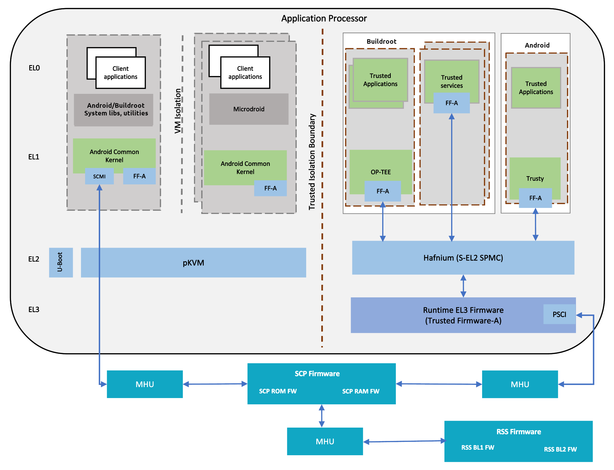

.. _docs/totalcompute/tc2/tc2_sw_stack:

Total Compute Platform Software Components
==========================================

RSS Firmware
------------
Runtime Security Subsystem (RSS) serves as the Root of Trust for the Total Compute platform.
	
RSS BL1 code is the first software that executes right after a cold reset or Power-on.
	
RSS initially boots from immutable code (BL1_1) in its internal ROM, before jumping to BL1_2, which is provisioned and hash-locked in RSS OTP.
The updatable MCUboot BL2 boot stage is loaded from the flash into RSS SRAM, where it is authenticated.
BL2 loads and authenticates the TF-M runtime into RSS SRAM from host flash. BL2 is also responsible for loading initial boot code into other subsystems within Total Compute as below.

 #. SCP BL1
 #. AP BL1

The following diagram illustrates the boot flow sequence:

.. figure:: tc2_bootflow.svg
   :alt: Total Compute boot flow sequence

SCP Firmware
------------
The System Control Processor (SCP) is a compute unit of Total Compute and is responsible for low-level system management. The SCP is a Cortex-M3 processor with a set of dedicated peripherals and interfaces that you can extend.
SCP firmware supports:

 #. Power-up sequence and system start-up
 #. Initial hardware configuration
 #. Clock management
 #. Servicing power state requests from the OS Power Management (OSPM) software

SCP BL1
........
It performs the following functions:

 #. Sets up generic timer, UART console and clocks
 #. Initializes the Coherent Interconnect
 #. Powers ON primary AP CPU
 #. Loads SCP Runtime Firmware

SCP Runtime Firmware
....................
SCP runtime code starts execution after TF-A BL2 has authenticated and copied it from flash.
It performs the following functions:

 #. Responds to SCMI messages via MHUv2 for CPU power control and DVFS
 #. Power Domain management
 #. Clock management

System MMU (aka SMMU or IOMMU)
..............................
System MMU, also known as SMMUv3 or IOMMU, is the Arm IP that isolates direct memory accesses from devices (DMA), and enables devices to access non-contiguous physical memory with configurable memory attributes.

Linux has two SMMUv3 drivers:
 * ``CONFIG_ARM_SMMU_V3`` enables the normal kernel driver that executes at ``EL1``;
 * ``CONFIG_ARM_SMMU_V3_PKVM`` enables a split driver that executes partly at ``EL2``, in the pKVM hypervisor.

When pKVM is enabled (``kvm-arm.mode=protected``), the pKVM SMMU driver takes precedence over the normal driver, and protects hypervisor and guest VMs from host DMA. Host device drivers still configure DMA using the Linux DMA API, and the hypervisor installs the requested virtual-to-physical translations into the SMMU stage-2 page tables, after making sure that a compromised host is not attempting via DMA to access memory it does not own.

AP Secure World Software
------------------------
Secure software/firmware is a trusted software component that runs in the AP secure world. It mainly consists of AP firmware, Secure Partition Manager and Secure Partitions (OP-TEE, Trusted Services).

AP firmware
...........
The AP firmware consists of the code that is required to boot Total Compute platform up to the point where the OS execution starts. This firmware performs architecture and platform initialization. It also loads and initializes secure world images like Secure partition manager and Trusted OS.

Trusted Firmware-A (TF-A) BL1
+++++++++++++++++++++++++++++
BL1 performs minimal architectural initialization (like exception vectors, CPU initialization) and Platform initialization. It loads the BL2 image and passes control to it.

Trusted Firmware-A (TF-A) BL2
+++++++++++++++++++++++++++++
BL2 runs at S-EL1 and performs architectural initialization required for subsequent stages of TF-A and normal world software. It configures the TrustZone Controller and carves out memory region in DRAM for secure and non-secure use. BL2 loads below images:

 #. SCP BL2 image
 #. EL3 Runtime Software (BL31 image)
 #. Secure Partition Manager (BL32 image)
 #. Non-Trusted firmware - U-boot (BL33 image)
 #. Secure Partitions images (OP-TEE and Trusted Services)

Trusted Firmware-A (TF-A) BL31
++++++++++++++++++++++++++++++
BL2 loads EL3 Runtime Software (BL31) and BL1 passes control to BL31 at EL3. In Total Compute BL31 runs at trusted SRAM. It provides the below mentioned runtime services:

 #. Power State Coordination Interface (PSCI)
 #. Secure Monitor framework
 #. Secure Partition Manager Dispatcher

Secure Partition Manager
........................
Total Compute enables FEAT S-EL2 architectural extension, and it uses Hafnium as Secure Partition Manager Core (SPMC). BL32 option in TF-A is re-purposed to specify the SPMC image. The SPMC component runs at S-EL2 exception level.

Secure Partitions
.................
Software image isolated using SPM is Secure Partition. Total Compute enables OP-TEE and Trusted Services as Secure Partitions.

OP-TEE
++++++
OP-TEE Trusted OS is virtualized using Hafnium at S-EL2. OP-TEE OS for Total Compute is built with FF-A and SEL2 SPMC support. This enables OP-TEE as a Secure Partition running in an isolated address space managed by Hafnium. The OP-TEE kernel runs at S-EL1 with Trusted applications running at S-EL0.

Trusted Services
++++++++++++++++
Trusted Services like Crypto Service, Internal Trusted Storage and Firmware Update runs as S-EL0 Secure Partitions.

Trusty
++++++
Trusty is a secure Operating System (OS) that provides a Trusted Execution Environment (TEE) for Android. Trusty is virtualized using Hafnium at S-EL2. FF-A support is added for Total Compute. Trusty runs as a Secure Partition running in an isolated address space managed by Hafnium. The Trusty kernel runs at S-EL1 with Trusted applications running at S-EL0.

AP Non-Secure World Software
----------------------------

U-Boot
......
TF-A BL31 passes execution control to U-boot bootloader (BL33). U-boot in Total Compute has support for multiple image formats:

 #. FitImage format: this contains the Linux kernel and Buildroot ramdisk which are authenticated and loaded in their respective positions in DRAM and execution is handed off to the kernel.
 #. Android boot image: This contains the Linux kernel and Android ramdisk. If using Android Verified Boot (AVB) boot.img is loaded via virtio to DRAM, authenticated and then execution is handed off to the kernel.

Linux Kernel
............
Linux Kernel in Total Compute contains the subsystem-specific features that demonstrate the capabilities of Total Compute. Apart from default configuration, it enables:

 #. Arm MHUv2 controller driver
 #. Arm FF-A driver
 #. OP-TEE driver with FF-A Transport Support
 #. Arm FF-A user space interface driver
 #. Trusty driver with FF-A Transport Support
 #. Virtualization using pKVM

Android
.......
Total Compute has support for Android Open-Source Project (AOSP), which contains the Android framework, Native Libraries, Android Runtime and the Hardware Abstraction Layers (HALs) for Android Operating system.
The Total Compute device profile defines the required variables for Android such as partition size and product packages and has support for the below configuration of Android:

 #. Software rendering: This profile has support for Android UI and boots Android to home screen. It uses SwiftShader to achieve this. Swiftshader is a CPU base implementation of the Vulkan graphics API by Google.

 #. Hardware rendering: This profile also has support for Android UI and boots Android to home screen. The Mali-G720 GPU model used for rendering.

Microdroid
++++++++++
Microdroid is a lightweight version of Android that runs in a protected virtual machine (pVM) and is managed by Android using CrosVM.
 
Buildroot
.........
A minimal rootfs that is useful for testing the bsp and boots quickly. The interface is text only and no graphics are supported.

Debian
......
This variant is based on the Debian 12 filesystem and supports hardware rendering based on DDK source code.

TensorFlow Lite Machine Learning
................................
A minimal CMake wrapper project for building TensorFlow Lite applications for Total Compute targets is provided. By default, this project will build the ``benchmark_model`` application, which allows to profile and validate ML inference flows. However, the developer can easily adapt the project and build any application exposed by TensorFlow Lite.

--------------

*Copyright (c) 2022-2023, Arm Limited. All rights reserved.*
