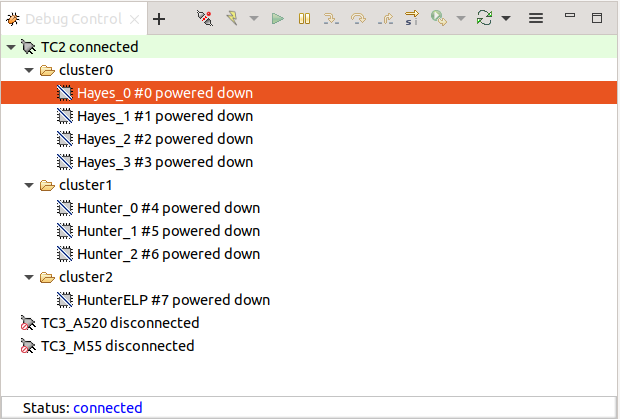
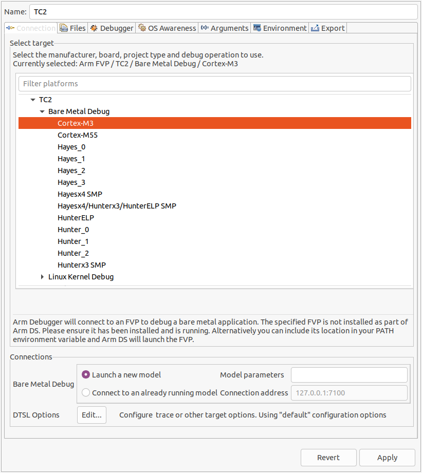
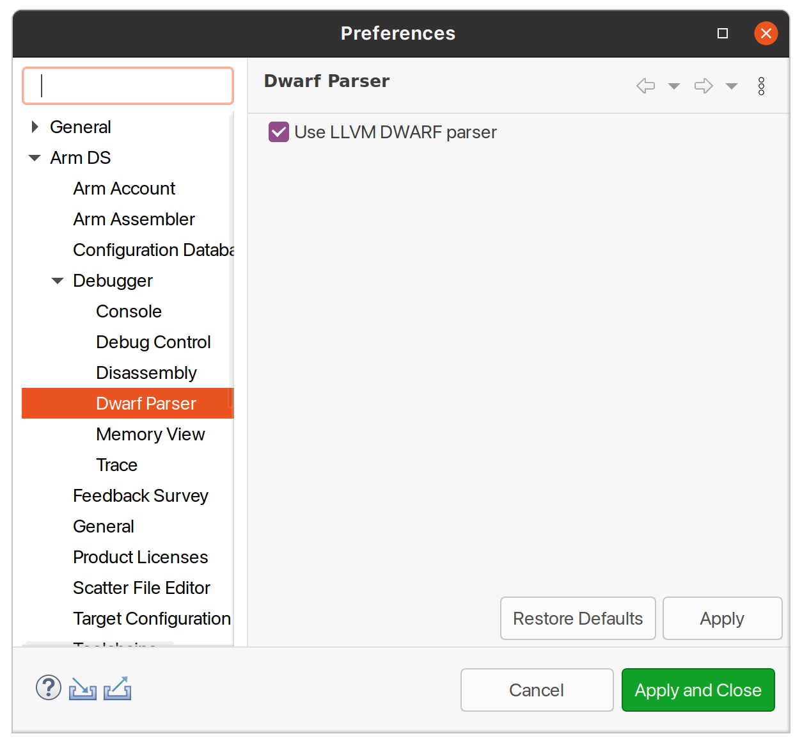
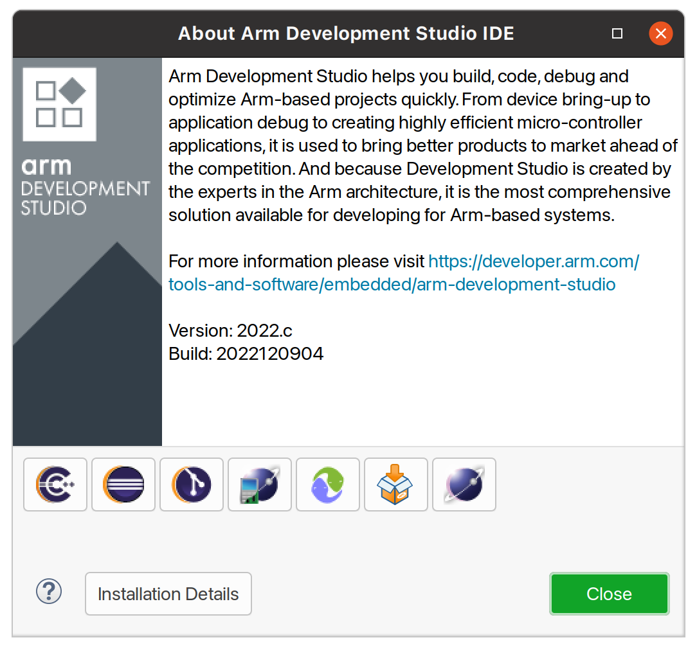

.. _docs/totalcompute/tc2/user-guide:

User Guide
==========

.. contents::

Notice
------

The Total Compute 2022 (TC2) software stack uses bash scripts to build a Board
Support Package (BSP) and a choice of three possible distributions including Buildroot, Debian or Android.

.. _docs/totalcompute/tc2/user-guide_prerequisites:

Prerequisites
-------------

These instructions assume that:
 * Your host PC is running Ubuntu Linux 20.04;
 * You are running the provided scripts in a ``bash`` shell environment;
 * This release requires TC2 Fast Model platform (FVP) version 11.23.17.

To get the latest repo tool from Google, please run the following commands:
::

    mkdir -p ~/bin
    curl https://storage.googleapis.com/git-repo-downloads/repo > ~/bin/repo
    chmod a+x ~/bin/repo
    export PATH=~/bin:$PATH

To build and run Android, the minimum requirements for the host machine can be found at https://source.android.com/setup/build/requirements. These include:
 * at least 250 GB of free disk space to check out the code and an extra 150 GB to build it. If you conduct multiple builds, you need additional space;
 * at least 32 GB of available RAM/swap.

To avoid errors while attempting to clone/fetch the different TC software components, your system should have a proper minimum ``git config`` configuration. The following command exemplifies the typical ``git config`` configuration required:

::

	git config --global user.name "<user name>"
	git config --global user.email "<email>"
	git config --global protocol.version 2

To install and allow access to docker, please run the following commands:
::

    sudo apt install docker.io
    # ensure docker service is properly started and running
    sudo systemctl restart docker
    sudo chmod 777 /var/run/docker.sock

To manage Docker as a non-root user, please run the following commands:
::

    sudo groupadd docker
    sudo usermod -aG docker $USER
    newgrp docker

Download the source code and build
----------------------------------

The TC2 software stack supports the following distros:
 * Buildroot (a minimal distro containing Busybox);
 * Debian (based on Debian 12 Bookworm);
 * Android (based on Android 13).

Download the source code
########################

Create a new folder that will be your workspace, which will henceforth be referred to as ``<TC2_WORKSPACE>``
in these instructions.
::

    mkdir <TC2_WORKSPACE>
    cd <TC2_WORKSPACE>
    export TC2_RELEASE=refs/tags/TC2-2023.10.04

To sync **Buildroot or Debian source code**, please run the following repo commands:
::

    repo init -u https://gitlab.arm.com/arm-reference-solutions/arm-reference-solutions-manifest \
		-m tc2.xml \
		-b ${TC2_RELEASE} \
		-g bsp
    repo sync -j `nproc` --fetch-submodules

To sync **Android source code**, please run the following repo commands:
::

    repo init -u https://gitlab.arm.com/arm-reference-solutions/arm-reference-solutions-manifest \
		-m tc2.xml \
		-b ${TC2_RELEASE} \
		-g android
    repo sync -j `nproc` --fetch-submodules

.. warning::
    Synchronization of the Android code from Google servers may fail due to connection problems and/or to an enforced rate limit related with the maximum number of concurrent fetching jobs. The previous commands assume that the maximum number of jobs concurrently fetching code will be a perfect match of the number of CPU cores available, which should work fine most of the time. If experiencing constant errors on consecutive fetch code attempts, please do consider deleting your entire workspace (which will ensure a clean of the support ``.repo`` folder containing the previously partial fetched files), by running the command ``cd .. ; rm -rf <TC2_WORKSPACE>`` and repeat the previous commands listed in this section to recreate the workspace (optionally, also reducing the number of jobs, for example to a maximum of 6, by adopting the following command ``repo sync -j 6 --fetch-submodules``).

Once the previous process finishes, the current ``<TC2_WORKSPACE>`` should have the following structure:
 * ``build-scripts/``: the components build scripts;
 * ``run-scripts/``: scripts to run the FVP;
 * ``src/``: each component's git repository.

Initial Setup
#############

The setup includes two parts:
 1. setup a docker image;
 2. setup the environment to build TC images.

Setting up a docker image involves pulling the prebuilt docker image from a docker registry. If that fails, it will build a local docker image.

To setup a docker image, patch the components, install the toolchains and build tools, please run the commands mentioned in the following :ref:`Build variants configuration <docs/totalcompute/tc2/user-guide_build_variants_conf>` section, according to the distro and variant of interest.

The various tools will be installed in the ``<TC2_WORKSPACE>/tools/`` directory.

Build options
#############

Debian OS build variant
***********************

Currently, the Debian OS build distro does not support software or hardware rendering. Considering this limitation, this build variant should be only used for development or validation work that does not imply pixel rendering.

Android OS build variants
*************************

.. note::
    Android based stack takes considerable time to build, so start the build and go grab a cup of coffee!

Hardware vs Software rendering
^^^^^^^^^^^^^^^^^^^^^^^^^^^^^^

The Android OS based build distro supports the following variants regarding the use of the GPU rendering:

+--------------+--------------------------------------------------------------------------------+
| TC_GPU value | Description                                                                    |
+==============+================================================================================+
| swr          | Android display with Swiftshader (software rendering)                          |
+--------------+--------------------------------------------------------------------------------+
| hwr          | Mali GPU (hardware rendering based on DDK source code - please see below note) |
+--------------+--------------------------------------------------------------------------------+
| hwr-prebuilt | Mali GPU (hardware rendering based on prebuilt binaries)                       |
+--------------+--------------------------------------------------------------------------------+

.. note::
    GPU DDK source code is available only to licensee partners (please contact support@arm.com).

Android Verified Boot (AVB) with/without authentication
^^^^^^^^^^^^^^^^^^^^^^^^^^^^^^^^^^^^^^^^^^^^^^^^^^^^^^^

The Android images can be built with or without authentication enabled using Android Verified Boot (AVB) through the use of the ``-a`` option.
AVB build is done in userdebug mode and takes a longer time to boot as the images are verified.
This option does not influence the way the system boots, rather it adds an optional sanity check on the prerequisite images.

.. _docs/totalcompute/tc2/user-guide_build_variants_conf:

Build variants configuration
############################

This section provides a quick guide on how to build the different TC build variants using the most common options.

Buildroot build
***************

To build the Buildroot distro, please run the following commands:
::

    export PLATFORM=tc2
    export FILESYSTEM=buildroot
    export TC_TARGET_FLAVOR=fvp
    cd build-scripts
    ./setup.sh

Debian build
************

Currently, the Debian build does not support software or hardware rendering. As such, the ``TC_GPU`` variable value should not be defined. The Debian build can still be a valuable resource when just considering other types of development or validation work, which do not involve pixel rendering.

Debian build (without software or GPU hardware rendering support)
^^^^^^^^^^^^^^^^^^^^^^^^^^^^^^^^^^^^^^^^^^^^^^^^^^^^^^^^^^^^^^^^^

To build the Debian distro, please run the following commands:
::

    export PLATFORM=tc2
    export FILESYSTEM=debian
    export TC_TARGET_FLAVOR=fvp
    cd build-scripts
    ./setup.sh

Android build
*************

To build Android with Android Verified Boot (AVB) enabled, please run the next command to enable the corresponding flag in addition to any of the following Android command variants (please note that this needs to be run before running ``./setup.sh``):
::

    export AVB=true

Android can be built with or without GPU hardware rendering support by setting the ``TC_GPU`` environment variable accordingly, as described in the following command usage examples.

Android build with hardware rendering support based on prebuilt binaries
^^^^^^^^^^^^^^^^^^^^^^^^^^^^^^^^^^^^^^^^^^^^^^^^^^^^^^^^^^^^^^^^^^^^^^^^

To build the Android distro with hardware rendering based on prebuilt binaries, please run the following commands:
::

    export PLATFORM=tc2
    export FILESYSTEM=android-fvp
    export TC_GPU=hwr-prebuilt
    export TC_TARGET_FLAVOR=fvp
    cd build-scripts
    ./setup.sh

Android build with hardware rendering support based on DDK source code
^^^^^^^^^^^^^^^^^^^^^^^^^^^^^^^^^^^^^^^^^^^^^^^^^^^^^^^^^^^^^^^^^^^^^^

To build the Android distro with hardware rendering based on DDK source code, please run the following commands:
::

    export PLATFORM=tc2
    export FILESYSTEM=android-fvp
    export TC_GPU=hwr
    export TC_TARGET_FLAVOR=fvp
    export GPU_DDK_REPO=<PATH TO GPU DDK SOURCE CODE>
    export GPU_DDK_VERSION="releases/r41p0_01eac0"
    export LM_LICENSE_FILE=<LICENSE FILE>
    export ARMLMD_LICENSE_FILE=<LICENSE FILE>
    export ARMCLANG_TOOL=<PATH TO ARMCLANG TOOLCHAIN>
    cd build-scripts
    ./setup.sh

.. note::
    GPU DDK source code is available only to licensee partners (please contact support@arm.com).

Android build with software rendering support
^^^^^^^^^^^^^^^^^^^^^^^^^^^^^^^^^^^^^^^^^^^^^

To build the Android distro with software rendering, please run the following commands:
::

    export PLATFORM=tc2
    export TC_GPU=swr
    export TC_TARGET_FLAVOR=fvp
    export FILESYSTEM=android-fvp
    cd build-scripts
    ./setup.sh

.. warning::
    If building the TC2 software stack for more than one target, please ensure you run a clean build between each different build to avoid setup/building errors (refer to the next section "*More about the build system*" for command usage examples on how to do this).

.. warning::
    If running ``repo sync`` again is needed at some point, then the ``setup.sh`` script also needs to be run again, as ``repo sync`` can discard the patches.

.. note::
    Most builds will be done in parallel using all the available cores by default. To change this number, run ``export PARALLELISM=<number of cores>``

Build command
#############

To build the whole TC2 software stack for any of the supported distros, simply run:
::

    ./run_docker.sh ./build-all.sh build

Once the previous process finishes, the previously defined environment variable ``$FILESYSTEM`` will be automatically used and the current ``<TC2_WORKSPACE>`` should have the following structure:
 * build files are stored in ``<TC2_WORKSPACE>/output/<$FILESYSTEM>/tmp_build/``;
 * final images will be placed in ``<TC2_WORKSPACE>/output/<$FILESYSTEM>/deploy/``.

More about the build system
###########################

The ``build-all.sh`` script will build all the components, but each component has its own script, allowing it to be built, cleaned and deployed separately.
All scripts support the ``build``, ``clean``, ``deploy``, ``patch`` commands. ``build-all.sh`` also supports ``all``, which performs a clean followed by a rebuild of all the stack.

For example, to build, deploy, and clean SCP, run:
::

    ./run_docker.sh ./build-scp.sh build
    ./run_docker.sh ./build-scp.sh deploy
    ./run_docker.sh ./build-scp.sh clean

The platform and filesystem used should be defined as described previously, but they can also be specified as the following example:
::

    ./run_docker.sh ./build-all.sh \
		-p $PLATFORM \
		-f $FILESYSTEM \
		-t $TC_TARGET_FLAVOR \
		-g $TC_GPU build

Build Components and its dependencies
#####################################

A new dependency to a component can be added in the form of ``$component=$dependency`` in the ``dependencies.txt`` file

To build a component and rebuild those components that depend on it, run:
::

    ./run_docker.sh ./$filename build with_reqs

Those options work for all the ``build-*.sh`` scripts.

Provided components
-------------------

Firmware Components
###################

Trusted Firmware-A
******************

Based on `Trusted Firmware-A <https://trustedfirmware-a.readthedocs.io/en/latest/>`__

+--------+------------------------------------------------------------------------------------------------------------+
| Script | <TC2_WORKSPACE>/build-scripts/build-tfa.sh                                                                 |
+--------+------------------------------------------------------------------------------------------------------------+
| Files  | * <TC2_WORKSPACE>/output/<$FILESYSTEM>/deploy/tc2/bl1-tc.bin                                               |
|        | * <TC2_WORKSPACE>/output/<$FILESYSTEM>/deploy/tc2/fip-tc.bin                                               |
+--------+------------------------------------------------------------------------------------------------------------+

System Control Processor (SCP)
******************************

Based on `SCP Firmware <https://github.com/ARM-software/SCP-firmware>`__

+--------+------------------------------------------------------------------------------------------------+
| Script | <TC2_WORKSPACE>/build-scripts/build-scp.sh                                                     |
+--------+------------------------------------------------------------------------------------------------+
| Files  | * <TC2_WORKSPACE>/output/<$FILESYSTEM>/deploy/tc2/scp_ramfw.bin                                |
|        | * <TC2_WORKSPACE>/output/<$FILESYSTEM>/deploy/tc2/scp_romfw.bin                                |
+--------+------------------------------------------------------------------------------------------------+

U-Boot
******

Based on `U-Boot <https://gitlab.denx.de/u-boot/u-boot>`__

+--------+---------------------------------------------------------------------------------------+
| Script | <TC2_WORKSPACE>/build-scripts/build-u-boot.sh                                         |
+--------+---------------------------------------------------------------------------------------+
| Files  | * <TC2_WORKSPACE>/output/<$FILESYSTEM>/deploy/tc2/u-boot.bin                          |
+--------+---------------------------------------------------------------------------------------+

Hafnium
*******

Based on `Hafnium <https://www.trustedfirmware.org/projects/hafnium>`__

+--------+--------------------------------------------------------------------------------------+
| Script | <TC2_WORKSPACE>/build-scripts/build-hafnium.sh                                       |
+--------+--------------------------------------------------------------------------------------+
| Files  | * <TC2_WORKSPACE>/output/<$FILESYSTEM>/deploy/tc2/hafnium.bin                        |
+--------+--------------------------------------------------------------------------------------+

OP-TEE
******

Based on `OP-TEE <https://github.com/OP-TEE/optee_os>`__

+--------+------------------------------------------------------------------------------------------+
| Script | <TC2_WORKSPACE>/build-scripts/build-optee-os.sh                                          |
+--------+------------------------------------------------------------------------------------------+
| Files  | * <TC2_WORKSPACE>/output/<$FILESYSTEM>/tmp_build/tfa_sp/tee-pager_v2.bin                 |
+--------+------------------------------------------------------------------------------------------+

S-EL0 trusted-services
**********************

Based on `Trusted Services <https://www.trustedfirmware.org/projects/trusted-services/>`__

+--------+-----------------------------------------------------------------------------------------------+
| Script | <TC2_WORKSPACE>/build-scripts/build-trusted-services.sh                                       |
+--------+-----------------------------------------------------------------------------------------------+
| Files  | * <TC2_WORKSPACE>/output/<$FILESYSTEM>/tmp_build/tfa_sp/crypto-sp.bin                         |
|        | * <TC2_WORKSPACE>/output/<$FILESYSTEM>/tmp_build/tfa_sp/internal-trusted-storage.bin          |
+--------+-----------------------------------------------------------------------------------------------+

Linux
*****

The component responsible for building a 5.15 version of the Android Common kernel (`ACK <https://android.googlesource.com/kernel/common/>`__).

+--------+-----------------------------------------------------------------------------------------------+
| Script | <TC2_WORKSPACE>/build-scripts/build-linux.sh                                                  |
+--------+-----------------------------------------------------------------------------------------------+
| Files  | * <TC2_WORKSPACE>/output/<$FILESYSTEM>/deploy/tc2/Image                                       |
+--------+-----------------------------------------------------------------------------------------------+

Trusty
******

Based on `Trusty <https://source.android.com/security/trusty>`__

+--------+---------------------------------------------------------------------------+
| Script | <TC2_WORKSPACE>/build-scripts/build-trusty.sh                             |
+--------+---------------------------------------------------------------------------+
| Files  | * <TC2_WORKSPACE>/output/<$FILESYSTEM>/deploy/tc2/lk.bin                  |
+--------+---------------------------------------------------------------------------+

Distributions
#############

Buildroot Linux distro
**********************

The layer is based on the `Buildroot <https://github.com/buildroot/buildroot/>`__ Linux distribution.
The provided distribution is based on BusyBox and built using ``glibc``.

+--------+-------------------------------------------------------------------------------------------------+
| Script | <TC2_WORKSPACE>/build-scripts/build-buildroot.sh                                                |
+--------+-------------------------------------------------------------------------------------------------+
| Files  | * <TC2_WORKSPACE>/output/<$FILESYSTEM>/deploy/tc2/tc-fitImage.bin                               |
+--------+-------------------------------------------------------------------------------------------------+

Debian Linux distro
*******************

+--------+-------------------------------------------------------------------------------------------------+
| Script | <TC2_WORKSPACE>/build-scripts/build-debian.sh                                                   |
+--------+-------------------------------------------------------------------------------------------------+
| Files  | * <TC2_WORKSPACE>/output/<$FILESYSTEM>/deploy/tc2/debian_fs.img                                 |
+--------+-------------------------------------------------------------------------------------------------+

Android
*******

+--------+-------------------------------------------------------------------------+
| Script | <TC2_WORKSPACE>/build-scripts/build-android.sh                          |
+--------+-------------------------------------------------------------------------+
| Files  | * <TC2_WORKSPACE>/output/<$FILESYSTEM>/deploy/tc2/android.img           |
|        | * <TC2_WORKSPACE>/output/<$FILESYSTEM>/deploy/tc2/ramdisk_uboot.img     |
|        | * <TC2_WORKSPACE>/output/<$FILESYSTEM>/deploy/tc2/system.img            |
|        | * <TC2_WORKSPACE>/output/<$FILESYSTEM>/deploy/tc2/userdata.img          |
|        | * <TC2_WORKSPACE>/output/<$FILESYSTEM>/deploy/tc2/boot.img (AVB only)   |
|        | * <TC2_WORKSPACE>/output/<$FILESYSTEM>/deploy/tc2/vbmeta.img (AVB only) |
+--------+-------------------------------------------------------------------------+

Run scripts
###########

Within the ``<TC2_WORKSPACE>/run-scripts/`` there are several convenience functions for testing the software
stack. Usage descriptions for the various scripts are provided in the following sections.

Obtaining the TC2 FVP
---------------------

The TC2 FVP is available to partners to build and run on Linux host environments.

To download the latest publicly available TC2 FVP model, please visit the |arm_ecosystem_fvp_download_link| webpage or contact Arm (support@arm.com).

.. |arm_ecosystem_fvp_download_link| raw:: html

   <a href="https://developer.arm.com/downloads/-/arm-ecosystem-fvps" target="_blank">Arm Ecosystem FVP downloads</a>

Running the software on FVP
---------------------------

A Fixed Virtual Platform (FVP) of the TC2 platform must be available to run the included run scripts.

The run-scripts structure is as follows:

::

    run-scripts
    |--tc2
       |--run_model.sh
       |-- ...

Ensure that all dependencies are met by running the FVP: ``./path/to/FVP_TC2``. You should see
the FVP launch, presenting a graphical interface showing information about the current state of the FVP.

The ``run_model.sh`` script in ``<TC2_WORKSPACE>/run-scripts/tc2`` will launch the FVP, providing
the previously built images as arguments. Run the ``./run_model.sh`` script:

::

    ./run_model.sh
    Incorrect script use, call script as:
    <path_to_run_model.sh> [OPTIONS]
    OPTIONS:
    -m, --model                      path to model
    -d, --distro                     distro version, values supported [buildroot, android-fvp, debian]
    -a, --avb                        [OPTIONAL] avb boot, values supported [true, false], DEFAULT: false
    -t, --tap-interface              [OPTIONAL] enable TAP interface
    -n, --networking                 [OPTIONAL] networking, values supported [user, tap, none]
                                     DEFAULT: tap if tap interface provided, otherwise user
    --	                             [OPTIONAL] After -- pass all further options directly to the model

Running Buildroot
#################

::

    ./run-scripts/tc2/run_model.sh -m <model binary path> -d buildroot

Running Debian
##############

::

    ./run-scripts/tc2/run_model.sh -m <model binary path> -d debian

Running Android
###############

Android general common run command
**********************************

The following command is common to Android builds with AVB disabled, software or any of the hardware rendering variants.
To run any of the mentioned Android variants, please run the following command:
::

    ./run-scripts/tc2/run_model.sh -m <model binary path> -d android-fvp

Android with AVB enabled
************************

To run Android with AVB enabled, please run the following command:
::

    ./run-scripts/tc2/run_model.sh -m <model binary path> -d android-fvp -a true

Expected behaviour
##################

When the script is run, four terminal instances will be launched:
 * ``terminal_uart_ap`` used by the non-secure world components U-boot, Linux Kernel and filesystem (Buildroot/Debian/Android);
 * ``terminal_uart1_ap`` used by the secure world components TF-A, Hafnium, Trusty and OP-TEE;
 * ``terminal_s0`` used for the SCP logs;
 * ``terminal_s1`` used by RSS logs (no output by default).

Once the FVP is running, the hardware Root of Trust will verify AP and SCP
images, initialize various crypto services and then handover execution to the
SCP. SCP will bring the AP out of reset. The AP will start booting from its
ROM and then proceed to boot Trusted Firmware-A, Hafnium,
Secure Partitions (OP-TEE, Trusted Services in Buildroot and Trusty in Android) then
U-Boot, and finally the corresponding Linux Kernel distro.

When booting Buildroot or Debian, the model will boot the Linux kernel and present a login prompt on the ``terminal_uart_ap`` window. Login
using the username ``root`` and the password ``root`` (password is only required for Debian). You may need to hit ``Enter`` for the prompt to appear.

When booting Android, the GUI window ``Fast Models - Total Compute 2 DP0`` shows the Android logo and on boot completion,
the window will show the typical Android home screen.

Running sanity tests
--------------------

This section provides information on some of the suggested sanity tests that can be executed to exercise and validate the TC Software stack functionality, as well as information regarding the expected behaviour and test results.

.. note::
    **The information presented for any of the sanity tests described in this section should NOT be considered as indicative of hardware performance.** These tests and the FVP model are only intended to validate the functional flow and behaviour for each of the features.

Validate the TensorFlow Lite ML flow
####################################

A typical Machine Learning (ML) inference flow can be validated using the TensorFlow Lite's model benchmarking application.

This application can consume any TensorFlow Lite neural network model file and run a user specified number of inferences on it, allowing to benchmark performance for the whole graph and for individual operators.

More information on the Model Benchmark tool can be found `here <https://github.com/tensorflow/tensorflow/blob/v2.13.0/tensorflow/lite/tools/benchmark/README.md>`__.

Prerequisites
*************

For this test, two files will be required:
 * ``benchmark_model`` binary: this file is part of the TC build and is automatically built when targeting Buildroot;
 * ``<any model>.tflite`` model: there is no requirement for a specific model file as long as it is specified in a valid ``.tflite`` format; for the simplicity of just running a sanity test, two models are provided with the build and are automatically integrated into the distro filesystem (being located at ``/opt/arm/ml``).

Running the provided TensorFlow Lite ML model examples
******************************************************

The following command describes how to run the ``benchmark_model`` application to profile the "Mobile Object Localizer" TensorFlow Lite model, which is one of the provided TensorFlow Lite ML model examples.

Although the command arguments are expected to greatly vary according to different use cases and models, this example provides the typical command usage skeleton for most of the models.

More information on the Model Benchmark Tool and command usage examples can be found `here <https://github.com/tensorflow/tensorflow/blob/v2.13.0/tensorflow/lite/tools/benchmark/README.md>`__.

To run the ``benchmark_model`` to profile the "Mobile Object Localizer" model, please follow the following steps:

 * using ``terminal_uart_ap``, login to the device/FVP model running TC and run the following commands:

	::

		# the following command ensures correct path location to load the provided example ML models
		cd /opt/arm/ml
		benchmark_model --graph=mobile_object_localizer_v1.tflite \
			--num_threads=4 --num_runs=1 --min_secs=0.01

The benchmark model application will run profiling the Mobile Object Localizer model and after a few seconds, some statistics and execution info will be presented on the terminal.

.. note::
    This test is specific to Buildroot.

Manually uploading a TensorFlow Lite ML model
*********************************************

There may be situations where the developer wishes to use their own TensorFlow Lite model.

This section describes the steps necessary to manually upload a model to the running TC FVP model and run it.

To the purpose of demonstrating this process, an old MobileNet Graph model version will be taken as example (the model can be downloaded from `here <https://storage.googleapis.com/download.tensorflow.org/models/tflite/mobilenet_v1_224_android_quant_2017_11_08.zip>`__).
To run the ``benchmark_model`` application and profile the "MobileNet Graph" model, please proceed as described:

 * start by downloading and decompressing the MobileNet graph model to your local host machine using the following command:

	::

		# any host path location can be used (as long it has writable permissions)
		mkdir MobileNetGraphTFModel && cd MobileNetGraphTFModel
		wget https://storage.googleapis.com/download.tensorflow.org/models/tflite/mobilenet_v1_224_android_quant_2017_11_08.zip
		unzip mobilenet_v1_224_android_quant_2017_11_08.zip

 * upload the MobileNet Graph model to the TC FVP model using the following command:

	::

		# the following command assumes that the port 8022 is being used as specified in the run_model.sh script
		scp -P 8022 mobilenet_quant_v1_224.tflite root@localhost:/opt/arm/ml/
		# password (if required): root

 * once the model has been uploaded to the remote TC FVP model, the ``benchmark_model`` can be run as described previously in the ``Running the provided TensorFlow Lite ML model examples`` section.

.. _docs/totalcompute/tc2/sanity-tests_optee:

OP-TEE
######

For OP-TEE, the TEE sanity test suite can be run using command ``xtest`` on the ``terminal_uart_ap``.

Please be aware that this test suite will take some time to run all its related tests.

.. note::
    This test is specific to Buildroot only. An example of the expected test result for this test is illustrated in the related :ref:`Total Compute Platform Expected Test Results <docs/totalcompute/tc2/expected-test-results_optee>` document section.

.. _docs/totalcompute/tc2/sanity-tests_ts:

Trusted Services and Client application
#######################################

For Trusted Services, please run the command ``ts-service-test -sg ItsServiceTests -sg PsaCryptoApiTests -sg CryptoServicePackedcTests -sg CryptoServiceProtobufTests -sg CryptoServiceLimitTests -v`` for Service API level tests, and run ``ts-demo`` for the demonstration of the client application.

.. note::
    This test is specific to Buildroot only. An example of the expected test result for this test is illustrated in the related :ref:`Total Compute Platform Expected Results <docs/totalcompute/tc2/expected-test-results_ts>` document section.

.. _docs/totalcompute/tc2/sanity-tests_trusty:

Trusty
######

On the Android distribution, Trusty provides a Trusted Execution Environment (TEE).
The functionality of Trusty IPC can be tested using the command ``tipc-test -t ta2ta-ipc`` with root privilege
(once Android boots to prompt, run ``su 0`` for root access).

.. note::
    This test is specific to Android only. An example of the expected test result for this test is illustrated in the :ref:`Total Compute Platform Expected Test Results <docs/totalcompute/tc2/expected-test-results_trusty>` document section.

.. _docs/totalcompute/tc2/sanity-tests_microdroid:

Microdroid demo
###############

On the Android distribution, Virtualization service provides support to run Microdroid based pVM (Protected VM).
For running a demo Microdroid, boot TC FVP with Android distribution. Once the Android is completely up, please run the following commands:

::

    export ANDROID_PRODUCT_OUT=<TC2_WORKSPACE>/src/android/out/target/product/tc_fvp/
    ./run-scripts/tc2/run_microdroid_demo.sh

.. note::
    This test is specific to Android only. An example of the expected test result for this test is illustrated in the related :ref:`Total Compute Platform Expected Test Results <docs/totalcompute/tc2/expected-test-results_microdroid>` document section.

.. _docs/totalcompute/tc2/sanity-tests_kselftest:

Kernel Selftest
###############

Tests are located at ``/usr/bin/selftest`` on the device.

To run all the tests in one go, use ``./run_kselftest.sh`` script. Tests can also be run individually.
::

    ./run_kselftest.sh --summary

.. warning::
    KSM driver is not a part of the TC2 kernel. Hence, one of the MTE Kselftests will fail for the ``check_ksm_options`` test.

.. note::
    This test is specific to Buildroot only. An example of the expected test result for this test is illustrated in the related :ref:`Total Compute Platform Expected Test Results <docs/totalcompute/tc2/expected-test-results_kernel>` document section.

.. _docs/totalcompute/tc2/sanity-tests_mpam:

MPAM
####

The hardware and the software requirements required for the MPAM feature can be verified by running the command ``testing_mpam.sh`` on ``terminal_uart_ap`` (this script is located inside the ``/bin`` folder, which is part of the default ``$PATH`` environment variable, allowing this command to be executed from any location in the device filesystem).

.. note::
    This test is specific to Buildroot only. An example of the expected test result for this test is illustrated in the related :ref:`Total Compute Platform Expected Test Results <docs/totalcompute/tc2/expected-test-results_mpam>` document section.

.. _docs/totalcompute/tc2/sanity-tests_mpmm:

MPMM
####

.. note::
    The following two tests require to execute the FVP-model enforcing the additional load of the ``ScalableVectorExtension.so`` plugin (which is provided and part of your FVP bundle). The following command demonstrates the typical command skeleton required to execute the fvp-model in this situation:

    ::

        ./run-scripts/tc2/run_model.sh -m <fvp-model binary path> -d buildroot \
			-- \
			--plugin <fvp-model plugin path/ScalableVectorExtension.so>

The functionality of the MPMM module in the SCP firmware can be leveraged to:
 * set the proper gear for each core based on the workload. This functionality can be verified by checking the ``INFO`` level SCP logs while executing the ``vector_workload`` test application on the ``terminal_uart_ap`` window as follows:

  ::

		vector_workload

 * enforce the maximum clock frequency for a group of cores of the same type, based on the current gear set for each core in that group. This functionality can be exercised by running the provided shell script ``test_mpmm.sh`` which will run ``vector_workload`` on the different cores. This test ensures that the maximum clock frequency for a group of cores of the same type does not exceed the values set in Perf Constraint Lookup Table (PCT) of the MPMM module in the SCP firmware.

  To run this test, please run the following command in the ``terminal_uart_ap`` window:
  ::

		test_mpmm.sh fvp

.. note::
    These tests are specific to Buildroot only. An example of the expected test result for the second test is illustrated in the related :ref:`Total Compute Platform Expected Test Results <docs/totalcompute/tc2/expected-test-results_mpmm>` document section.

.. _docs/totalcompute/tc2/sanity-tests_bti:

BTI
###

On the ``terminal_uart_ap`` run:
::

    cd /data/nativetest64/bti-unit-tests/
    ./bti-unit-tests

.. note::
    This test is specific to Android builds. An example of the expected test result for this test is illustrated in the related :ref:`Total Compute Platform Expected Test Results <docs/totalcompute/tc2/expected-test-results_bti>` document section.

.. _docs/totalcompute/tc2/sanity-tests_mte:

MTE
###

On the ``terminal_uart_ap`` run:
::

    su
    cd /data/nativetest64/mte-unit-tests/
    ./mte-unit-tests

.. note::
    This test is specific to Android builds. An example of the expected test result for this test is illustrated in the related :ref:`Total Compute Platform Expected Test Results <docs/totalcompute/tc2/expected-test-results_mte>` document section.

.. _docs/totalcompute/tc2/sanity-tests_pauth:

PAUTH
#####

On the ``terminal_uart_ap`` run:
::

    su
    cd /data/nativetest64/pauth-unit-tests/
    ./pauth-unit-tests

.. note::
    This test is specific to Android builds. An example of the expected test result for this test is illustrated in the related :ref:`Total Compute Platform Expected Test Results <docs/totalcompute/tc2/expected-test-results_pauth>` document section.

.. _docs/totalcompute/tc2/sanity-tests_lisa:

EAS with LISA
#############

This test requires Lisa to be installed. Please refer to the `LISA documentation <https://lisa-linux-integrated-system-analysis.readthedocs.io/en/master/setup.html#installation>`_ to get more information about the requirements, dependencies and installation process of LISA on your system.

To setup Lisa, please run the following commands:
::

    git clone --depth=1 --branch=v3.1.0 https://github.com/ARM-software/lisa.git
    cd lisa
    sudo ./install_base.sh --install-all

The following commands should be run each time LISA is run:
::

    source init_env
    export TC_WORKSPACE=<TC2_WORKSPACE>
    export FILESYSTEM=buildroot

For FVP with buildroot, boot the FVP model to buildroot as you normally would, making sure user networking is enabled:
::

    exekall run lisa.tests.scheduler.eas_behaviour --conf <path to target_conf_linux.yml>

The following excerpt illustrates the contents of the ``target_conf_buildroot.yml`` file:
::

    target-conf:
      kind: linux
      name: tc
      host: localhost
      port: 8022
      username: root
      password: ""
      strict-host-check: false

      kernel:
        src: ${TC_WORKSPACE}/output/${FILESYSTEM}/tmp_build/linux

        modules:
          make-variables:
            CC: clang
          build-env: alpine

      wait-boot:
        enable: false

      devlib:
        file-xfer: scp
        max-async: 1

.. note::
    This test is specific to Buildroot only. An example of the expected test result for this test is illustrated in the related :ref:`Total Compute Platform Expected Test Results <docs/totalcompute/tc2/expected-test-results_eas>` document section.

pKVM SMMUv3 driver support validation
#####################################

The SMMUv3 driver support can be validated by checking the bootlog messages or by running the following presented command. This section describes and educates what output to expect for both situations where the driver is loaded and enabled, or when it fails or is disabled.

On the ``terminal_uart_ap`` run:
::

    realpath /sys/bus/platform/devices/3f000000.smmu_700/driver

When the **pKVM driver is loaded and enabled with success**, the previous command should report an output similar to the following one:
::

    $ realpath /sys/bus/platform/devices/3f000000.smmu_700/driver
    /sys/bus/platform/drivers/kvm-arm-smmu-v3

If the **pKVM driver fails to load or is disabled**, the previous command should report an output similar to the following one:
::

    $ realpath /sys/bus/platform/devices/3f000000.smmu_700/driver
    /sys/bus/platform/drivers/arm-smmu-v3

More information about the pKVM driver loading, initialisation phase and it being used by a device driver can be checked during the bootlog messages or by running the command ``dmesg``, which should contain entries similar to the following:
::

    (...)
    [    0.035500][    T1] iommu: Default domain type: Translated
    [    0.035506][    T1] iommu: DMA domain TLB invalidation policy: strict mode
    (...)
    [    0.073258][    T1] kvm [1]: IPA Size Limit: 40 bits
    [    0.091014][    T1] kvm-arm-smmu-v3 3f000000.smmu_700: ias 40-bit, oas 40-bit (features 0x0000dfef)
    [    0.091426][    T1] kvm-arm-smmu-v3 3f000000.smmu_700: allocated 65536 entries for cmdq
    [    0.091435][    T1] kvm-arm-smmu-v3 3f000000.smmu_700: 2-level strtab only covers 23/32 bits of SID
    [    0.092569][    T9] Freeing initrd memory: 1328K
    [    0.096695][    T1] kvm [1]: GICv4 support disabled
    [    0.096702][    T1] kvm [1]: GICv3: no GICV resource entry
    [    0.096709][    T1] kvm [1]: disabling GICv2 emulation
    [    0.096731][    T1] kvm [1]: GIC system register CPU interface enabled
    [    0.096788][    T1] kvm [1]: vgic interrupt IRQ9
    [    0.096861][    T1] kvm [1]: Protected nVHE mode initialized successfully
    (...)
    [    0.151372][    T7] komeda 2cc00000.display: Adding to iommu group 0
    (...)
    [   34.986406][    T7] mali 2d000000.gpu: Adding to iommu group 1
    (...)

Considering the previous output excerpt, the last line confirms that the system is using pKVM instead of the classic KVM driver.

.. note::
    This test is applicable to all TC build distro variants.

.. _docs/totalcompute/tc2/sanity-tests_cpuFeatures:

CPU hardware capabilities
#########################

The Buildroot build variant provides a script that allows to validate the advertisement for the ``FEAT_AFP``, ``FEAT_ECV`` and ``FEAT_WFxT`` CPU hardware capabilities.

On the ``terminal_uart_ap`` run:
::

    test_feats_arch.sh

.. note::
    This test is specific to Buildroot only. An example of the expected test result for this test is illustrated in the related :ref:`Total Compute Platform Expected Test Results <docs/totalcompute/tc2/expected-test-results_cpu_feat>` document section.

Debugging on Arm Development Studio
-----------------------------------

This section describes the steps to debug the TC software stack using `Arm Development Studio <https://developer.arm.com/Tools%20and%20Software/Arm%20Development%20Studio>`_.

Attach and Debug
################

#. Build the target with debug enabled (the file ``<TC2_WORKSPACE>/build-scripts/config`` can be configured to enable debug);
#. Run the distro as described in the section ``Running the software on FVP`` with the extra parameters ``-- -I`` to attach to the debugger. The full command should look like the following:

	::

	./run-scripts/tc2/run_model.sh -m <model binary path> -d <distro> -- -I

#. Select the target ``Arm FVP -> TC2 -> Bare Metal Debug -> Hayesx4/Hunterx3/HunterELP SMP``
#. After connection, use options in debug control console (highlighted in the below diagram) or the keyboard shortcuts to ``step``, ``run`` or ``halt``.
#. To add debug symbols, right click on target -> ``Debug configurations`` and under ``files`` tab add path to ``elf`` files.
#. Debug options such as ``break points``, ``variable watch``, ``memory view`` and so on can be used.

.. note::
    This configuration requires Arm DS version 2023.a or later. The names of the cores shown are based on codenames instead of product names.
    The mapping for the actual names follows the below described convention:

	+-------------+--------------+
	| Codename    | Product name |
	+=============+==============+
	| Hayes       | Cortex A520  |
	+-------------+--------------+
	| Hunter      | Cortex A720  |
	+-------------+--------------+
	| Hunter ELP  | Cortex X4    |
	+-------------+--------------+

Switch between SCP and AP
#########################

#. Right click on target and select ``Debug Configurations``;
#. Under ``Connection``, select ``Cortex-M3`` for SCP or any of the remaining targets to attach to a specific AP (please refer to the previous note regarding the matching between the used codenames and actual product names);
#. Press the ``Debug`` button to confirm and start your debug session.

Enable LLVM parser (for Dwarf5 support)
#######################################

To enable LLVM parser (with Dwarf5 support), please follow the next steps:

#. Select ``Window->Preferences->Arm DS->Debugger->Dwarf Parser``;
#. Tick the ``Use LLVM DWARF parser`` option;
#. Click the ``Apply and Close`` button.

Arm DS version
##############

The previous steps apply to the following Arm DS Platinum version/build:

.. note::
    Arm DS Platinum is only available to licensee partners. Please contact Arm to have access (support@arm.com).

Feature Guide
-------------

Firmware Update
###############
Currently, the firmware update functionality is only supported with the buildroot distro.

Creating Capsule
****************

Firmware Update in the total compute platform uses the capsule update mechanism. Hence, the Firmware Image Package (FIP) binary
has to be converted to a capsule. This can be done with ``GenerateCapsule`` which is present in ``BaseTools/BinWrappers/PosixLike``
of the `edk2 project <https://github.com/tianocore/edk2>`__.

To generate the capsule from the fip binary, run the following command:
::

    ./GenerateCapsule -e -o efi_capsule \
		--fw-version 1 \
		--lsv 0 \
		--guid 0d5c011f-0776-5b38-8e81-36fbdf6743e2 \
		--update-image-index 0 \
		--verbose fip-tc.bin

Command argument's explanation:
 * ``fip-tc.bin`` is the input fip file that has the firmware binaries of the total compute platform;
 * ``efi_capsule`` is the name of capsule to be generated;
 * ``0d5c011f-0776-5b38-8e81-36fbdf6743e2`` is the image type UUID for the FIP image.

Loading Capsule
***************

The capsule generated using the above steps has to be loaded into memory during the execution of the model by providing the below FVP arguments:

::

    --data board.dram=<location of capsule>/efi_capsule@0x2000000

This will load the capsule to be updated at address ``0x82000000``.

The final command to run the model for buildroot should look like the following:

::

    ./run-scripts/tc2/run_model.sh -m <model binary path> -d buildroot \
		-- \
		--data board.dram=<location of capsule>/efi_capsule@0x2000000

Updating Firmware
*****************

During the normal boot of the platform, stop at the U-Boot prompt and execute the following command:

::

    TOTAL_COMPUTE# efidebug capsule update -v 0x82000000

This will update the firmware. After it is completed, reboot the platform using the FVP GUI.

AutoFDO in Android
##################
Feedback Directed Optimization (FDO), also known as Profile Guided Optimization (PGO), uses the profile of a program's execution to guide the optimizations performed by the compiler.

More information about the AutoFDO process in ARM can be found `here <https://github.com/Linaro/OpenCSD/blob/master/decoder/tests/auto-fdo/autofdo.md>`__.

Prerequisites
*************

To make use of this feature, the following two requisites should be observed:

* the application must be compiled to include sufficient debug information to map instructions back to source lines. For ``clang``/``llvm``, this translates into adding the ``-fdebug-info-for-profiling`` and ``-gline-tables-only`` compiler options;

* ``simpleperf`` will identify the active program or library using the build identifier stored in the elf file. This requires the use of the following compiler flag ``-Wl,--build-id=sha1`` to be added during link time.

The following example demonstrates how to compile a sample C program named ``program.c`` using ``clang`` and observing these two prerequisites:

::

	clang --fdebug-info-for-profiling -gline-tables-only -Wl,--build-id=sha1 program.c -o program

Steps to use AutoFDO
********************

The following steps describe how to upload the resulting ``program`` binary object to the fvp-model, how to generate and convert the execution trace into source level profiles, and how to download and reuse that to optimize the next compiler builds:

#. connect to the fvp-model running instance;

	Please refer to the :ref:`ADB - Connect to the running FVP-model instance <docs/totalcompute/tc2/user-guide_adb-connect>` section for more info how to do this.

#. upload the previous resulting ``program`` binary object to the remote ``/usr/bin`` path location;

	Please refer to the :ref:`ADB - Upload a file <docs/totalcompute/tc2/user-guide_adb-upload>` section for more info how to do this.

#. using the ``terminal_uart_ap`` window, navigate into ``/storage/self`` path location and elevate your privilege level to ``root`` (required and crucial for next steps). This can be achieved by running the following commands on the specified terminal window:

	::

		cd /storage/self
		su

#. record the execution trace of the program;

	The ``simpleperf`` application in Android is used to record the execution trace of the application. This trace will be captured by collecting the ``cs_etm`` event from ``simpleperf`` and will be stored in a ``perf.data`` file.

	The following command demonstrates how to make use of the ``simpleperf`` application to record the execution trace of the ``program`` application (this command is intended to be run on the fvp-model via the ``terminal_uart_ap`` window):

	::

		simpleperf record -e cs-etm program

	More info on the ``simpleperf`` tool can be found `here <https://developer.android.com/ndk/guides/simpleperf>`__.

#. convert the execution trace to instruction samples with branch histories;

	The execution trace can be converted to an instruction profile using the ``simpleperf`` application. The following ``simpleperf inject`` command will decode the execution trace and generate branch histories in text format accepted by AutoFDO (this command is intended to be run on the fvp-model via the ``terminal_uart_ap`` window):

	::

		simpleperf inject -i perf.data -o inj.data --output autofdo --binary program

#. convert the instruction samples to source level profiles;

	The `AutoFDO <https://github.com/google/autofdo>`__ tool is used to convert the instruction profiles to source profiles for the ``GCC`` and ``clang``/``llvm`` compilers.

	This requires to pull the instruction profile (generated in the previous step and saved as ``inj.data`` file), from the model to the host machine using the ``adb`` command (please refer to the :ref:`ADB - Download a file <docs/totalcompute/tc2/user-guide_adb-download>` section for more info how to do this).

	The instruction samples produced by ``simpleperf inject`` will be passed to the AutoFDO tool to generate source level profiles for the compiler. The following line demonstrates the usage command for ``clang``/``llvm`` (this command is intended to be run on the host machine):

	::

		create_llvm_prof -binary=program -profile=inj.data -out=program.llvmprof

#. use the source level profile with the compiler;

	The profile produced by the above steps can now be provided to the compiler to optimize the next build of the ``program`` application. For ``clang``, use the ``-fprofile-sample-use`` compiler option as follows (this command is intended to be run on the host machine):

	::

		clang -O2 -fprofile-sample-use=program.llvmprof -o program program.c

.. _docs/totalcompute/tc2/user-guide_adb:

ADB connection on Android
#########################

This section applies to Android distros and describes the steps required to use ADB protocol to perform the following actions (always considering a remote running FVP-model Android instance):
 * connect to a running fvp-model instance;
 * upload a file;
 * download a file;
 * execute a command via ADB shell.

.. _docs/totalcompute/tc2/user-guide_adb-connect:

Connect to the running FVP-model instance
*****************************************

#. run the fvp-model and wait for the instance to fully boot up (this may take a considerable amount of time depending on the distro under test and the host hardware specification);
#. once the Android distro boot completes (and the ``Fast Models - Total Compute 2 DP0`` window shows the complete Android home screen), run the following commands on a new host terminal session to connect to the fvp-model running instance via the ``adb`` protocol:

  ::

	adb connect 127.0.0.1:5555
	adb devices

  The following excerpt capture demonstrates the execution and expected output from the previous commands:

  ::

	# adb connect 127.0.0.1:5555
	* daemon not running; starting now at tcp:5037
	* daemon started successfully
	connected to 127.0.0.1:5555
	# adb devices
	List of devices attached
	127.0.0.1:5555	offline

.. note::
    If the previous command fails to connect, please wait a few more minutes and retry. Due to the indeterministic services boot flow nature, this may circumvent situations where the fvp-model Android instance takes a bit longer to start all the required services and correctly allow communications to happen.

.. warning::
    If running more than one FVP-model on the same host, each instance will get a different ADB port assigned. The assigned ADB port is mentioned during the FVP-model start up phase. Please ensure you are using the correct assigned/mentioned ADB port and adapt the commands mentioned in this entire section as needed (i.e. replacing default port ``5555`` or ``<fvp adb port>`` mentions with the correct port being used).

.. _docs/totalcompute/tc2/user-guide_adb-upload:

Upload a file
*************
#. connect or ensure that an ADB connection to the fvp-model is established;
#. run the following command to upload a local file to the remote fvp-model Android running instance:

  ::

	adb -s <fvp adb port> push <local host location for original file> <remote absolute path location to save file>

.. note::
    It may happen that the ADB connection is lost between the connection moment and the moment that the previous command is run. If that happens, please repeat the connection step and the previous command.

.. _docs/totalcompute/tc2/user-guide_adb-download:

Download a file
***************
#. connect or ensure that an ADB connection to the fvp-model is established;
#. run the following command to download a remote file to your local host system:

  ::

	adb -s <fvp adb port> pull <remote absolute path location for original file> <local host location where to save file>

.. note::
    It may happen that the ADB connection is lost between the connection moment and the moment that the previous command is run. If that happens, please repeat the connection step and the previous command.

.. _docs/totalcompute/tc2/user-guide_adb-shell:

Execute a remote command
************************

  ::

	adb -s <fvp adb port> shell <command>

Example:

  ::

	adb -s <fvp adb port> shell ls -la

.. note::
    It may happen that the ADB connection is lost between the connection moment and the moment that the previous command is run. If that happens, please repeat the connection step and the previous command.

Set up TAP interface for Android ADB
####################################

This section applies to Android and details the steps required to set up the tap interface on the host for model networking for ADB.

The following method relies on ``libvirt`` handling the network bridge. This solution provides a safer approach in which, in cases where a bad configuration is used, the primary network interface should continue operational.

Steps to set up the tap interface
*********************************

To set up the tap interface, please follow the next steps (unless otherwise mentioned, all commands are intended to be run on the host system):

#. install ``libvirt`` on your development host system:

    ::

	sudo apt-get update && sudo apt-get install libvirt-daemon-system libvirt-clients

    The host system should now list a new interface with a name similar to ``virbr0`` and an IP address of ``192.168.122.1``.
    This can be verified by running the command ``ifconfig -a`` (or alternatively ``ip a s`` for newer distributions) which will produce an output similar to the following:

    ::

	$ ifconfig -a
	virbr0: flags=4099<UP,BROADCAST,MULTICAST>  mtu 1500
        inet 192.168.122.1  netmask 255.255.255.0  broadcast 192.168.122.255
        ether XX:XX:XX:XX:XX:XX  txqueuelen 1000  (Ethernet)
        RX packets 0  bytes 0 (0.0 B)
        RX errors 0  dropped 0  overruns 0  frame 0
        TX packets 0  bytes 0 (0.0 B)
        TX errors 0  dropped 0 overruns 0  carrier 0  collisions 0

	virbr0-nic: flags=4098<BROADCAST,MULTICAST>  mtu 1500
        ether XX:XX:XX:XX:XX:XX  txqueuelen 1000  (Ethernet)
        RX packets 0  bytes 0 (0.0 B)
        RX errors 0  dropped 0  overruns 0  frame 0
        TX packets 0  bytes 0 (0.0 B)
        TX errors 0  dropped 0 overruns 0  carrier 0  collisions 0
	$

#. create the ``tap0`` interface:

    ::

	sudo ip tuntap add dev tap0 mode tap user $(whoami)
	sudo ifconfig tap0 0.0.0.0 promisc up
	sudo brctl addif virbr0 tap0

#. download and install the Android SDK from `here <https://developer.android.com/studio>`__ or, alternatively, install the ``adb`` tool package as follows:

    ::

	sudo apt-get install adb

#. run the FVP model providing the additional parameter ``-t "tap0"`` to enable the tap interface:

    ::

	./run-scripts/tc2/run_model.sh -m <model binary path> -d android-fvp -t "tap0"

    Before proceeding, please allow Android FVP model to fully boot and the Android home screen display to be visible on the ``Fast Models - Total Compute 2 DP0`` window.

    .. note::
	Running and booting the Android FVP model will take considerable time, potentially taking easily 2-3+ hours depending on your host system hardware specification. Please grab a coffee and relax.

#. once the Android FVP model boots, the Android instance should get an IP address similar to ``192.168.122.62``, as illustrated in the next figure:

	.. figure:: tap_interface_ip_addr.png
		:alt: Android FVP-model IP address configuration

#. validate the connection between the host ``tap0`` interface and the Android FVP model by running the following command **on the fvp-model** via the ``terminal_uart_ap`` window:

    ::

	ping 192.168.122.1

    Alternatively, it is also possible to validate if the fvp-model can reach a valid internet gateway by pinging, for instance, the IP address ``8.8.8.8`` instead.

#. at this stage, you should also be able to establish an ADB connection and upload/download files as described in section :ref:`ADB connection on Android <docs/totalcompute/tc2/user-guide_adb>`.

Steps to graceful disable and remove the tap interface
******************************************************

To revert the configuration of your host system (removing the ``tap0`` interface), please follow the next steps:

#. remove the ``tap0`` from the bridge configuration:

    ::

	sudo brctl delif virbr0 tap0

#. disable the bridge interface:

    ::

	sudo ip link set virbr0 down

#. remove the bridge interface:

    ::

	sudo brctl delbr virbr0

#. remove the ``libvirt`` package:

    ::

	sudo apt-get remove libvirt-daemon-system libvirt-clients

.. _docs/totalcompute/tc2/user-guide_fvp_traces:

Running and Collecting FVP tracing information
##############################################

This section describes how to run the FVP-model, enabling the output of trace information for debug and troubleshooting purposes.
To illustrate proper trace output information that can be obtained at different stages, the following command examples will use the SMMU-700 block component. However, any of the commands mentioned, can be extended or adapted easily for any other component.

.. note::
    This functionality requires to execute the FVP-model enforcing the additional load of the ``GenericTrace.so`` or ``ListTraceSources.so`` plugins (which are provided and part of your FVP bundle).

Getting the list of trace sources
*********************************

To get the list of trace sources available on the FVP-model, please run the following command:

    ::

	<fvp-model binary path>/FVP_TC2 \
		--plugin <fvp-model plugin path/ListTraceSources.so> \
		>& /tmp/trace-sources-fvp-tc2.txt

This will start the model and use the ``ListTraceSources.so`` plugin to dump the list to a file. Please note that the file size can easily extend to tens of megabytes, as the list is quite extensive.

The following excerpt illustrates the output information related with the example component SMMU-700:

    ::

	Component (1439) providing trace: TC2.css.smmu (MMU_700, 11.23.17)
	=============================================================================
	Component is of type "MMU_700"
	Version is "11.23.17"
	#Sources: 299

	Source ArchMsg.Error.error (These messages are about activity occurring on the SMMU that is considered an error.
	Messages will only come out here if parameter all_error_messages_through_trace is true.

	DISPLAY %{output})
		Field output type:MTI_STRING size:0 max_size:120 (The stream output)

	Source ArchMsg.Error.fetch_from_memory_type_not_supporting_httu (A descriptor fetch from an HTTU-enabled translation regime to an unsupported
	memory type was made.  Whilst the fetch itself may succeed, if an update to
	the descriptor was attempted then it would fail.)

Executing the FVP-model with traces enabled
*******************************************

To execute the FVP-model with trace information enabled, please run the following command:

    ::

	./run-scripts/tc2/run_model.sh -m <model binary path> -d <distro> \
		-- \
		--plugin <fvp-model plugin path/GenericTrace.so> \
		-C 'TRACE.GenericTrace.trace-sources="TC2.css.smmu.*"' \
		-C TRACE.GenericTrace.flush=true

Multiple trace sources can be requested by separating the trace-sources strings with commas.
By default, the trace information will be displayed to the standard output (e.g. display), which due to its verbosity may not be always the ideal solution. For such situations, it is suggested to redirect and capture the trace information into a file, which can be achieved by running the following command:

    ::

	./run-scripts/tc2/run_model.sh -m <model binary path> -d <distro> \
		-- \
		--plugin <fvp-model plugin path/GenericTrace.so> \
		-C 'TRACE.GenericTrace.trace-sources="TC2.css.smmu.*"' \
		-C TRACE.GenericTrace.flush=true \
		>& /tmp/trace-fvp-tc2.txt

The following output excerpt illustrates an example of the trace information captured for the DPU (``streamid=0x00000100``) and GPU (``streamid=0x00000200``):

    ::

	(...)
	start_ptw_read: trans_id=0x000000000000020f streamid=0x00000100 substreamid=0xffffffff ttb_grain_stage_and_level=0x00000201 pa_address=0x0000008083fdc018 input_address=0x00000000ffe00000 ssd_ns=ssd_ns ns=bus-ns desckind=el2_or_st2_aarch64 inner_cache=rawaWB outer_cache=rawaWB aprot=DNP adomain=ish mpam_pmg_and_partid=0x00000000 ssd=ns pas=ns mecid=0xffffffff
	verbose_commentary: output="Performing a Table Walk read as:-"
	verbose_commentary: output="    trans_id:527-st2-final-l1-aa64-ttb0-vmid:0-ns-sid:256"
	verbose_commentary: output="to ns-0x0000008083fdc018-PND-u0x53000009-m0xffffffff-ish-osh-rawaC-rawaC of size 8B"
	verbose_commentary: output="Table Walk finished:-"
	verbose_commentary: output="    trans_id:527-st2-final-l1-aa64-ttb0-vmid:0-ns-sid:256"
	verbose_commentary: output="got:-"
	verbose_commentary: output="    0x0000008083fdc018: 0x0000008085c31003"
	ptw_read: trans_id=0x000000000000020f streamid=0x00000100 substreamid=0xffffffff ttb_grain_stage_and_level=0x00000201 pa_address=0x0000008083fdc018 input_address=0x00000000ffe00000 ssd_ns=ssd_ns ns=bus-ns desckind=el2_or_st2_aarch64 inner_cache=rawaWB outer_cache=rawaWB aprot=DNP adomain=ish abort=ok data=0x0000008085c31003 ssd=ns pas=ns mecid=0xffffffff
	ptw_read_st2_table_descriptor: trans_id=0x000000000000020f streamid=0x00000100 substreamid=0xffffffff ttb_grain_stage_and_level=0x00000201 pa_address=0x0000008083fdc018 input_address=0x00000000ffe00000 ssd_ns=ssd_ns ns=bus-ns desckind=el2_or_st2_aarch64 APTable=aptable_no_effect XNTable=N PXNTable=N TableAddress=0x0000008085c31000 ssd=ns pas=ns mecid=0xffffffff
	(...)
	start_ptw_read: trans_id=0x000000000000033b streamid=0x00000200 substreamid=0xffffffff ttb_grain_stage_and_level=0x00000201 pa_address=0x00000080872a7010 input_address=0x00000080844db000 ssd_ns=ssd_ns ns=bus-ns desckind=el2_or_st2_aarch64 inner_cache=rawaWB outer_cache=rawaWB aprot=DNP adomain=ish mpam_pmg_and_partid=0x00000000 ssd=ns pas=ns mecid=0xffffffff
	verbose_commentary: output="Performing a Table Walk read as:-"
	verbose_commentary: output="    trans_id:827-st2-final-l1-aa64-ttb0-vmid:1-ns-sid:512"
	verbose_commentary: output="to ns-0x00000080872a7010-PND-u0x53000109-m0xffffffff-ish-osh-rawaC-rawaC of size 8B"
	verbose_commentary: output="Table Walk finished:-"
	verbose_commentary: output="    trans_id:827-st2-final-l1-aa64-ttb0-vmid:1-ns-sid:512"
	verbose_commentary: output="got:-"
	verbose_commentary: output="    0x00000080872a7010: 0x000000808a52d003"
	ptw_read: trans_id=0x000000000000033b streamid=0x00000200 substreamid=0xffffffff ttb_grain_stage_and_level=0x00000201 pa_address=0x00000080872a7010 input_address=0x00000080844db000 ssd_ns=ssd_ns ns=bus-ns desckind=el2_or_st2_aarch64 inner_cache=rawaWB outer_cache=rawaWB aprot=DNP adomain=ish abort=ok data=0x000000808a52d003 ssd=ns pas=ns mecid=0xffffffff
	ptw_read_st2_table_descriptor: trans_id=0x000000000000033b streamid=0x00000200 substreamid=0xffffffff ttb_grain_stage_and_level=0x00000201 pa_address=0x00000080872a7010 input_address=0x00000080844db000 ssd_ns=ssd_ns ns=bus-ns desckind=el2_or_st2_aarch64 APTable=aptable_no_effect XNTable=N PXNTable=N TableAddress=0x000000808a52d000 ssd=ns pas=ns mecid=0xffffffff
	(...)

--------------

*Copyright (c) 2022-2023, Arm Limited. All rights reserved.*
