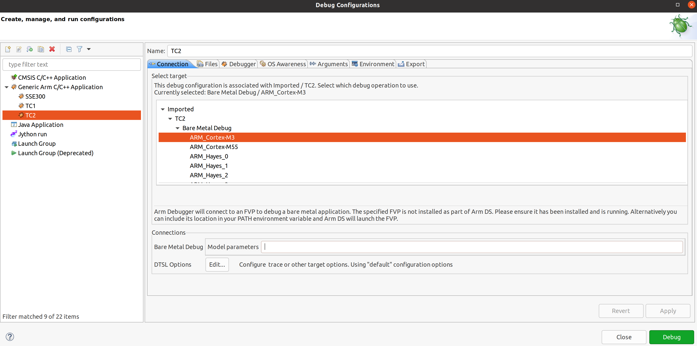

.. _docs/totalcompute/tc2/user-guide:

User Guide
==========

.. contents::

Notice
------

The Total Compute 2022 (TC2) software stack uses bash scripts to build a Board
Support Package (BSP) and a choice of Buildroot Linux distribution or Android
userspace.

Prerequisites
-------------

These instructions assume that:
 * Your host PC is running a recent Ubuntu Linux (18.04 or 20.04)
 * You are running the provided scripts in a ``bash`` shell environment.

To get the latest repo tool from google, run the following commands:

::

    mkdir -p ~/bin
    curl https://storage.googleapis.com/git-repo-downloads/repo > ~/bin/repo
    chmod a+x ~/bin/repo
    export PATH=~/bin:$PATH

If syncing and building android, the minimum requirements for the host machine can be found at https://source.android.com/setup/build/requirements, These include:
 * At least 250GB of free disk space to check out the code and an extra 150 GB to build it. If you conduct multiple builds, you need additional space.
 * At least 32 GB of available RAM/swap.
 * Git configured properly using "git config" otherwise it may throw error while fetching the code.

The software requirements can be automatically installed by running
``requirements.sh`` with sudo, once the code is synced. They can also be
installed by running the following steps:
(Note: Python modules will be installed in a virtual environment)

To install the required packages, run:

::

    sudo apt install -y chrpath gawk texinfo diffstat wget git unzip \
    build-essential socat cpio python3 python3-pip python3-pexpect xz-utils debianutils \
    iputils-ping python3-git libegl1-mesa libsdl1.2-dev xterm git-lfs openssl \
    curl lib32ncurses5-dev libz-dev u-boot-tools m4 zip liblz4-tool zstd make \
    dwarves ninja-build libssl-dev srecord libelf-dev bison flex libncurses5 \ 
    uuid-dev libgnutls28-dev

For Ubuntu 18.04:
::
  
    sudo apt install pylint3 python-pip python

For ubuntu 20.04:
::

    sudo apt install pylint python

To install and allow access to docker
::

    sudo apt install docker.io
    sudo chmod 777 /var/run/docker.sock

Syncing and building the source code
------------------------------------

There are two distros supported in the TC2 software stack: buildroot (a minimal distro containing busybox) and Android.

Syncing code
############

Create a new folder that will be your workspace, which will henceforth be referred to as ``<tc2_workspace>``
in these instructions.
::

    mkdir <tc2_workspace>
    cd <tc2_workspace>
    export TC2_RELEASE=refs/tags/TC2-2022.12.07

To sync BSP only without Android, run the following repo command.
::

    repo init -u https://gitlab.arm.com/arm-reference-solutions/arm-reference-solutions-manifest -m tc2.xml -b ${TC2_RELEASE} -g bsp
    repo sync -j `nproc` --fetch-submodules

To sync both the BSP and Android, run the following repo command.
::

    repo init -u https://gitlab.arm.com/arm-reference-solutions/arm-reference-solutions-manifest -m tc2.xml -b ${TC2_RELEASE} -g android
    repo sync -j `nproc` --fetch-submodules

The resulting files will have the following structure:
 - build-scripts/: the components build scripts
 - run-scripts/: scripts to run the FVP
 - src/: each component's git repository

Initial Setup
#############

NOTE: python cryptography module is needed, but might be already installed as an apt package in an older version. If this is the case, run
::

    sudo apt remove python3-cryptography

Setup includes two parts:
 1. Setup a Docker image
 2. Setup the environmet to build TC images

Setting up a docker image involves pulling the prebuilt docker image from a docker registry. If that fails, it will build a local docker image.

To setup a docker image, patch the components, install the toolchains and build tools, run:

For buildroot build:
::

    export PLATFORM=tc2
    export FILESYSTEM=buildroot
    ./setup.sh

For an Android build:
::

    export PLATFORM=tc2
    export FILESYSTEM=android-swr
    ./setup.sh

The various tools will be installed in the tools/ directory at the root of the workspace.

To build Android with AVB (Android Verified Boot) enabled, run:
::

    export AVB=true

NOTES:

* If running ``repo sync`` again is needed at some point, then the setup.sh script also needs to be run again, as repo sync can discard the patches.

* Most builds will be done in parallel using all the available cores by default. To change this number, run ``export PARALLELISM=<no of cores>``

Board Support Package build
############################

To build the whole stack, simply run:
::

    ./run_docker.sh ./build-all.sh build

Build files are stored in build-scripts/output/tmp_build/, final images will be placed in build-script/output/deploy/.

More about the build system
###########################

``build-all.sh`` will build all the components, but each component has its own script, allowing it to be built, cleaned and deployed separately.
All scripts support the ``build``, ``clean``, ``deploy``, ``patch`` commands. ``build-all.sh`` also supports ``all``, to clean then rebuild all the stack.

For example, to build, deploy, and clean SCP, run
::

    ./run_docker.sh ./build-scp.sh build
    ./run_docker.sh ./build-scp.sh deploy
    ./run_docker.sh ./build-scp.sh clean

The platform and filesystem used should be defined as described previously, but they can also be specified like so:
::

    ./run_docker.sh ./build-all -p $PLATFORM -f $FILESYSTEM build

Build Components and its dependencies
-------------------------------------

A new dependency to a component can be added in the form of ``$component=$dependency`` in dependencies.txt file

To build a component and rebuild those components that depend on it
::

    ./run_docker.sh ./$filename build with_reqs

Additionally, Android Verified Boot (AVB) can be enabled with the ``-a`` option.
Those options work for all the ``build-*.sh`` scripts.

Android OS build
#################

* tc2_swr  : This supports Android display with swiftshader (software rendering).

The android images can be built with or without authentication enabled using Android Verified Boot(AVB).
AVB build is done in userdebug mode and takes a longer time to boot as the images are verified.

The ``-a`` option does not influence the way the system boots rather it adds an optional sanity check on the prerequisite images.

Android based stack takes considerable time to build, so start the build and go grab a cup of coffee!

Note
####

If you encounter the below build error,
::

    -- Check for working CXX compiler: /usr/bin/aarch64-linux-gnu-gcc - broken
    -- Configuring incomplete, errors occurred!

remove the installed cross compiler
::

    sudo apt-get remove gcc-aarch64-linux-gnu

Provided components
-------------------

Firmware Components
###################

Trusted Firmware-A
******************

Based on `Trusted Firmware-A <https://trustedfirmware-a.readthedocs.io/en/latest/>`__

+--------+------------------------------------------------------------------------------------------------------------+
| Script | <tc2_workspace>/build-scripts/build-tfa.sh                                                                 |
+--------+------------------------------------------------------------------------------------------------------------+
| Files  | * <tc2_workspace>/build-scripts/output/deploy/tc2/bl1-tc.bin                                               |
|        | * <tc2_workspace>/build-scripts/output/deploy/tc2/fip-tc.bin                                               |
+--------+------------------------------------------------------------------------------------------------------------+

System Control Processor (SCP)
******************************

Based on `SCP Firmware <https://github.com/ARM-software/SCP-firmware>`__

+--------+------------------------------------------------------------------------------------------------+
| Script | <tc2_workspace>/build-scripts/build-scp.sh                                                     |
+--------+------------------------------------------------------------------------------------------------+
| Files  | * <tc2_workspace>/build-scripts/output/deploy/tc2/scp_ramfw.bin                                |
|        | * <tc2_workspace>/build-scripts/output/deploy/tc2/scp_romfw.bin                                |
+--------+------------------------------------------------------------------------------------------------+

U-Boot
******

Based on `U-Boot gitlab <https://gitlab.denx.de/u-boot/u-boot>`__

+--------+---------------------------------------------------------------------------------------+
| Script | <tc2_workspace>/build-scripts/build-u-boot.sh                                         |
+--------+---------------------------------------------------------------------------------------+
| Files  | * <tc2_workspace>/build-scripts/output/deploy/tc2/u-boot.bin                          |
+--------+---------------------------------------------------------------------------------------+

Hafnium
*******

Based on `Hafnium <https://www.trustedfirmware.org/projects/hafnium>`__

+--------+--------------------------------------------------------------------------------------+
| Script | <tc2_workspace>/build-scripts/build-hafnium.sh                                       |
+--------+--------------------------------------------------------------------------------------+
| Files  | * <tc2_workspace>/build-scripts/output/deploy/tc2/hafnium.bin                        |
+--------+--------------------------------------------------------------------------------------+

OP-TEE
******

Based on `OP-TEE <https://github.com/OP-TEE/optee_os>`__

+--------+------------------------------------------------------------------------------------------+
| Script | <tc2_workspace>/build-scripts/build-optee-os.sh                                          |
+--------+------------------------------------------------------------------------------------------+
| Files  | * <tc2_workspace>/build-scripts/output/tmp_build/tfa_sp/tee-pager_v2.bin                 |
+--------+------------------------------------------------------------------------------------------+

S-EL0 trusted-services
**********************

Based on `Trusted Services <https://www.trustedfirmware.org/projects/trusted-services/>`__

+--------+-----------------------------------------------------------------------------------------------+
| Script | <tc2_workspace>/build-scripts/build-trusted-services.sh                                       |
+--------+-----------------------------------------------------------------------------------------------+
| Files  | * <tc2_workspace>/build-scripts/output/tmp_build/tfa_sp/crypto-sp.bin                         |
|        | * <tc2_workspace>/build-scripts/output/tmp_build/tfa_sp/internal-trusted-storage.bin          |
+--------+-----------------------------------------------------------------------------------------------+

Linux
*****

The component responsible for building a 5.15 version of the Android Common kernel (`ACK <https://android.googlesource.com/kernel/common/>`__).

+--------+-----------------------------------------------------------------------------------------------+
| Script | <tc2_workspace>/build-scripts/build-linux.sh                                                  |
+--------+-----------------------------------------------------------------------------------------------+
| Files  | * <tc2_workspace>/build-scripts/output/deploy/tc2/Image                                       |
+--------+-----------------------------------------------------------------------------------------------+

Trusty
******

Based on `Trusty <https://source.android.com/security/trusty>`__

+--------+---------------------------------------------------------------------------+
| Script | <tc2_workspace>/build-scripts/build-trusty.sh                             |
+--------+---------------------------------------------------------------------------+
| Files  | * <tc2_workspace>/build-scripts/output/deploy/tc2/lk.bin                  |
+--------+---------------------------------------------------------------------------+

Distributions
#############

Buildroot Linux distro
**********************

The layer is based on the `buildroot <https://github.com/buildroot/buildroot/>`__ Linux distribution.
The provided distribution is based on BusyBox and built using glibc.

+--------+-------------------------------------------------------------------------------------------------+
| Script | <tc2_workspace>/build-scripts/build-buildroot.sh                                                |
+--------+-------------------------------------------------------------------------------------------------+
| Files  | * <tc2_workspace>/build-scripts/output/deploy/tc2/tc-fitImage.bin                               |
+--------+-------------------------------------------------------------------------------------------------+

Android
*******

+--------+-------------------------------------------------------------------------+
| Script | <tc2_workspace>/build-scripts/build-android.sh                          |
+--------+-------------------------------------------------------------------------+
| Files  | * <tc2_workspace>/build-scripts/output/deploy/tc2/android.img           |
|        | * <tc2_workspace>/build-scripts/output/deploy/tc2/ramdisk_uboot.img     |
|        | * <tc2_workspace>/build-scripts/output/deploy/tc2/system.img            |
|        | * <tc2_workspace>/build-scripts/output/deploy/tc2/userdata.img          |
|        | * <tc2_workspace>/build-scripts/output/deploy/tc2/boot.img (AVB only)   |
|        | * <tc2_workspace>/build-scripts/output/deploy/tc2/vbmeta.img (AVB only) |
+--------+-------------------------------------------------------------------------+

Run scripts
###########

Within the ``<tc2_workspace>/run-scripts/`` are several convenience functions for testing the software
stack. Usage descriptions for the various scripts are provided in the following sections.

Obtaining the TC2 FVP
---------------------

The TC2 FVP is available to partners for build and run on Linux host environments.
Please contact Arm to have access (support@arm.com).

Running the software on FVP
---------------------------

A Fixed Virtual Platform (FVP) of the TC2 platform must be available to run the included run scripts.

The run-scripts structure is as follows:

::

    run-scripts
    |--tc2
       |--run_model.sh
       |-- ...

Ensure that all dependencies are met by running the FVP: ``./path/to/FVP_TC2``. You should see
the FVP launch, presenting a graphical interface showing information about the current state of the FVP.

The ``run_model.sh`` script in ``<tc2_workspace>/bsp/run-scripts/tc2`` will launch the FVP, providing
the previously built images as arguments. Run the ``run_model.sh`` script:

::

       ./run_model.sh
       Incorrect script use, call script as:
       <path_to_run_model.sh> [OPTIONS]
       OPTIONS:
       -m, --model                      path to model
       -d, --distro                     distro version, values supported [buildroot, android-swr]
       -a, --avb                        [OPTIONAL] avb boot, values supported [true, false], DEFAULT: false
       -t, --tap-interface              [OPTIONAL] enable TAP interface
       -e, --extra-model-params	        [OPTIONAL] extra model parameters

Running Buildroot
#################

::

        ./run-scripts/tc2/run_model.sh -m <model binary path> -d buildroot

Running Android
###############

For running android with AVB disabled:
::
 
     ./run-scripts/tc2/run_model.sh -m <model binary path> -d android-swr
 
For running android with AVB enabled:
::

     ./run-scripts/tc2/run_model.sh -m <model binary path> -d android-swr -a true
 
Run FVP model from docker container
###################################

To run FVP in docker container export required licenses and run:
::

    export MODEL_PATH=<Absolute path to model parent directory>
    ./run_docker.sh run_model -m Absolute_path_to_model -d distro_opts

When the script is run, three terminal instances will be launched.
terminal_uart_ap used for TF-M firmware logs, terminal_s0 used for the SCP,
TF-A, OP-TEE core logs and terminal_s1 used by TF-A early boot, Hafnium, U-boot
and Linux.

Once the FVP is running, hardware Root of Trust will verify AP and SCP
images, initialize various crypto services and then handover execution to the
SCP. SCP will bring the AP out of reset.  The AP will start booting from its
ROM and then proceed to boot Trusted Firmware-A, Hafnium,
Secure Partitions (OP-TEE, Trusted Services in Buildroot and Trusty in Android) then
U-Boot, and then Linux and Buildroot/Android.

When booting Buildroot the model will boot Linux and present a login prompt on terminal_s1. Login
using the username ``root``. You may need to hit Enter for the prompt to appear.

The OP-TEE and Trusted Services are initialized in Buildroot distribution. The functionality of OP-TEE and
core set of trusted services such as Crypto and Internal Trusted Storage can be invoked only on Builroot distribution.
For OP-TEE, the TEE sanity test suite can be run using command ``xtest`` on terminal_s1.
For Trusted Services, run command ``ts-service-test -sg ItsServiceTests -sg PsaCryptoApiTests -sg
CryptoServicePackedcTests -sg CryptoServiceProtobufTests -sg CryptoServiceLimitTests -v`` for Service API level tests
and run command ``ts-demo`` for the demonstration client application.

On Android distribution, Trusty provides a Trusted Execution Environment (TEE).
The functionality of Trusty IPC can be tested using command ``tipc-test -t ta2ta-ipc`` with root privilege.
(Once Android boots to prompt, do ``su 0`` for root access)

While booting, GUI window - ``Fast Models - Total Compute 2 DP0`` shows Android logo and on boot completion,
the window will show the Android home screen.

On Android distribution, Virtualization service provides support to run Microdroid based pVM (Protected VM).
For running a demo Microdroid, boot TC FVP with Android distribution. Once the Android is completely up, run below command:

::

 ./run-scripts/tc2/run_microdroid_demo.sh

Debugging on Arm Development Studio
-----------------------------------

Creating a new connection
#########################

#. File->new->model connection
#. Name it and next
#. Add a new model and select CADI interface
#. Select ``Launch and select a specific model``
#. Give TC2 FVP model path and Finish
#. Close

Attach and Debug
################

#. Build the target with debug enabled. ``build-scripts/config`` can be configured to enable debug.
#. Run Buildroot/Android as described above.
#. Select the target created as mentioned in ``Creating a new connection`` and ``connect to target`` from debug control console.
#. After connection, use options in debug control console (highlighted in the below diagram) or keyboard shortcuts to ``step``, ``run`` or ``halt``.
#. To add debug symbols, right click on target -> ``Debug configurations`` and under ``files`` tab add path to ``elf`` files.
#. Debug options such as ``break points``, ``variable watch``, ``memory view`` and so on can be used.

.. figure:: Debug_control_console.png

Switch between SCP and AP
#########################

#. Right click on target and select ``Debug Configurations``
#. Under ``Connection``, select ``Cortex-M3`` for SCP and ``Arm-Hayes_x/Arm-Hunter_x`` for AP core x and then debug

Kernel Selftest
###############

Test are located at /usr/bin/selftest on device

To run all the tests in one go, use run_selftest.sh script. Tests can be run individually also.
::

    ./run_kselftest --summary

NOTE:

KSM driver is not a part of TC2 kernel. Hence, one of the MTE Kselftests fail for check_ksm_options test.

Building the Mali GPU DDK
#########################

The Mali GPU DDK is not part of this release and hence needs to be
obtained separately.  Also, note that the GPU is not modelled in the
FVP.  The version that has been tested is r40p0_01eac0. These
instructions assume you have the Mali DDK in the directory $MALI_DDK
with all submodules. These instructions assume you are building the
DDK for Android but do not cover device profile changes. The three
components of the DDK build are the linux device driver, the CSF
firmware and gralloc.

Building the linux driver
-------------------------
The driver, mali_kbase.ko, must be build as a module. One method is to do this in-tree.

#. cp -R $MALI_DDK/product/kernel/drivers $MALI_DDK/product/kernel/include src/linux
#. Edit the kbuild system to include the driver as described by this patch.

::

      diff --git a/drivers/Kconfig b/drivers/Kconfig
      index e346c35f42b4..978e083d1427 100644
      --- a/drivers/Kconfig
      +++ b/drivers/Kconfig
      @@ -238,4 +238,6 @@ source "drivers/interconnect/Kconfig"
      source "drivers/counter/Kconfig"
      
      source "drivers/most/Kconfig"
      +source "drivers/base/arm/Kconfig"
      +source "drivers/gpu/arm/midgard/Kconfig"
      endmenu
      diff --git a/drivers/base/Makefile b/drivers/base/Makefile
      index ef8e44a7d288..1151ad6ff861 100644
      --- a/drivers/base/Makefile
      +++ b/drivers/base/Makefile
      @@ -33,3 +33,4 @@ ccflags-$(CONFIG_DEBUG_DRIVER) := -DDEBUG
      # define_trace.h needs to know how to find our header
      CFLAGS_trace.o         := -I$(src)
      obj-$(CONFIG_TRACING)  += trace.o
      +obj-y +=                       arm/
      diff --git a/drivers/gpu/Makefile b/drivers/gpu/Makefile
      index 835c88318cec..37888b7ecf31 100644
      --- a/drivers/gpu/Makefile
      +++ b/drivers/gpu/Makefile
      @@ -6,3 +6,4 @@ obj-$(CONFIG_TEGRA_HOST1X)      += host1x/
      obj-y                  += drm/ vga/
      obj-$(CONFIG_IMX_IPUV3_CORE)   += ipu-v3/
      obj-$(CONFIG_TRACE_GPU_MEM)            += trace/
      +obj-y                  += arm/

Building the csf firmware
-------------------------

#. cd $MALI_DDK
#. export KERNEL_DIR=<tc2_workspace>/bsp/src/linux
#. mkdir -p build_cfw
#. export BUILDDIR=$PWD/build_cfw
#. bldsys/bootstrap_linux.bash
#. build_cfw/config LINUX=y CSFFW=y EGL=y GPU_TTIX=y RELEASE=y DEBUG=n SYMBOLS=n GLES=y CL=n VULKAN=y TARGET_GNU_PREFIX=<tc2_workspace>/bsp/tools/gcc-arm-11.2-2022.02-x86_64-aarch64-none-linux-gnu/bin/aarch64-none-linux-gnu- KERNEL_DIR=$KERNEL_DIR
#. build_cfw/buildme csffw

Incorporate this in an Android build:

#. mkdir -p <tc2_workspace>/android/vendor/arm/mali/product/firmware
#. cp build_cfw/install/bin/mali_csffw.bin firmware_prebuilt/ttix

Building gralloc
----------------

Copy or clone the Mali DDK into the android tree at <tc2_workspace>/android/vendor/arm/mali/
This assumes a lunch target 'tc2_hwr' has been created.

#. cd <tc2_workspace>/android/
#. source build/envsetup.sh
#. lunch tc2_hwr
#. cd vendor/arm/mali/product
#. ./setup_android ANDROID=y CSFFW=n EGL=y GPU_TTIX=y RELEASE=y DEBUG=n SYMBOLS=n GLES=y CL=n VULKAN=y INSTRUMENTATION_GFX=y KERNEL_DIR=$KERNEL_DIR KERNEL_COMPILER=<tc2_workspace>/bsp/tools/gcc-arm-11.2-2022.02-x86_64-aarch64-none-linux-gnu/bin/aarch64-none-linux-gnu- KERNEL_CC=$TC2_ANDROID/prebuilts/clang/host/linux-x86/clang-r416183b/bin/clang USES_REFERENCE_GRALLOC=y REFERENCE_GRALLOC_XML=y
#. ./android/gralloc/configure
#. mmm
#. mm

Firmware Update
---------------

Creating Capsule
################

Firmware Update in the total compute platform uses the capsule update mechanism. Hence, the Firmware Image Package (FIP) binary
has to be converted to a capsule. This can be done with ``GenerateCapsule`` which is present in ``BaseTools/BinWrappers/PosixLike``
of the `edk2 project <https://github.com/tianocore/edk2>`__.

::

       GenerateCapsule -e -o efi_capsule --fw-version 1 --lsv 0 --guid 0d5c011f-0776-5b38-8e81-36fbdf6743e2 --verbose --update-image-index 0 --verbose fip-tc.bin

| "fip-tc.bin" is the input fip file that has the firmware binaries of the total compute platform
| "efi_capsule" is the name of capsule to be generated
| "0d5c011f-0776-5b38-8e81-36fbdf6743e2" is the image type UUID for the FIP image

Loading Capsule
###############

The capsule generated using the above steps has to be loaded into memory during the execution of the model by providing the below FVP arguments.

::

       --data board.dram=<location of capsule>/efi_capsule@0x2000000

This loads the capsule to be updated at address 0x82000000

Updating Firmware
#################

During the normal boot of the platform, stop at the U-Boot prompt and execute the below commands.

::

       TOTAL_COMPUTE# efidebug capsule update -v 0x82000000

This will update the firmware. After it is completed, reboot the platform using the FVP GUI

*Copyright (c) 2023, Arm Limited. All rights reserved.*
